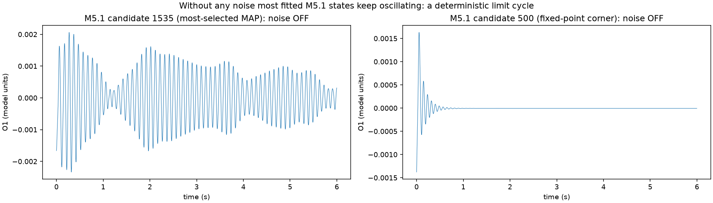
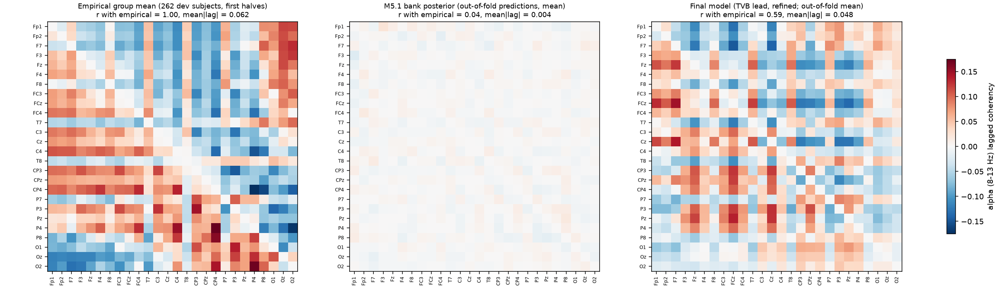
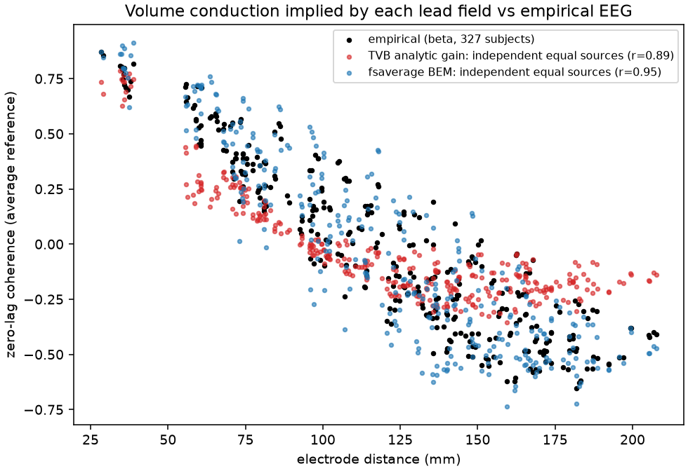
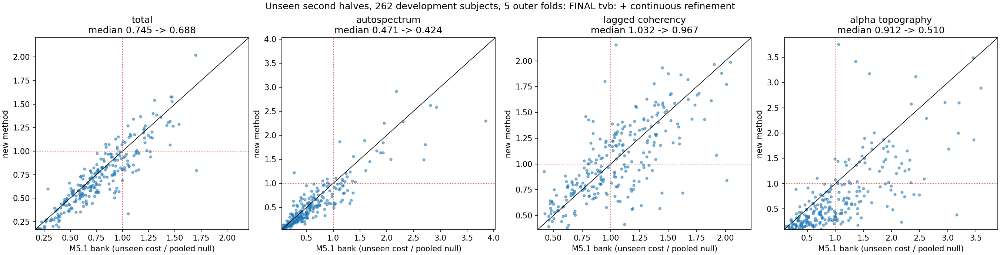
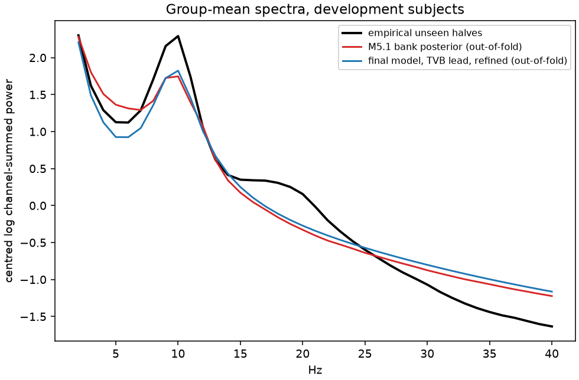

# Independent audit and redesign of the MDD–TVB fitting pipeline

**Date:** 2026-09-24 · **Scope:** the full repository at `af4e1e9` and the complete previous agent session
(`first-session.md`, 37 user turns) · **Status of this document:** findings final; results section filled from
runs stored under `outputs/audit_claude/` and `outputs/linear_regime/`.

---

## 0. Bottom line

The pipeline is carefully engineered (leakage control, nested folds, provenance, tests). The poor fit does **not**
come from bad bookkeeping. It comes from five modelling decisions, each measured below:

1. **The fitted model is a deterministic alpha oscillator, not noise-driven resting EEG.** With the noise
   switched off, the M5.1 MAP state of **318 of 327 subjects keeps oscillating** (a limit cycle, ~9.3 Hz). The
   noise-free oscillation carries a median **2.1×** the 2–40 Hz variance of the noisy simulation. This is the
   root of the "too smooth/artificial" EEG noticed at the start, of the median **62 % diagonal observation
   noise** the posterior needs, and of the weak spatial control (limit-cycle amplitude ignores the input-noise
   contrasts that were the only spatial parameters).
2. **The model class cannot produce the empirical lagged connectivity.** Empirical alpha lagged coherency is
   0.149 (individual test-retest r = 0.80) vs 0.071 in the bank, which is the estimation-noise floor. White-matter
   delays or slow local coupling in a stable network produce ~0.0003. A shared, delayed ("travelling-wave") alpha
   drive from dorsal central/parietal cortex reproduces the empirical group pattern (**r = 0.59**) and
   magnitude (0.069 vs 0.062).
3. **The objective silently became an alpha-only fit** and ignores the zero-lag spatial covariance. All 16
   lagged-coherency and 13/16 autospectral coordinates kept by the reliability filter are 9–11 Hz; no
   theta/beta coordinate survives.
4. **Finite-bank inference was resolution-limited**: 2,048 states in 15 dimensions ≈ 1.7 per axis, posterior
   ESS ≈ 4. The "oracle 0.688 ⇒ the model is inadequate" argument was not valid, because the oracle is
   confined to the same 2,048 points.
5. **The "single-sphere" TVB lead field is an infinite-homogeneous-medium dipole formula**: too focal and
   frontally biased. The fsaverage BEM reproduces empirical volume conduction far better (pattern r 0.94 vs 0.87,
   neighbour coherence 0.74 vs 0.55; empirical 0.70–0.78). The M5.2 test was confounded: limit-cycle regime,
   spatial modes derived in the analytic basis, and no zero-lag term in the objective. In a fair re-test (§5.4)
   the BEM wins on lagged coherency and fold stability but *still* loses on alpha topography under the M5.1
   metric. The lead-field choice is genuinely open until zero-lag structure is scored.

Also: EMG contaminates 30–40 Hz at temporal/lateral-frontal electrodes, and the raw files contain EOG and
masseter-EMG channels that were discarded. The Healthy group is 6 years younger (p < 0.001). And TDBRAIN
contains **167 rTMS-treated MDD patients with responder/remitter labels and BDI pre/post** whose baseline EEG
is already on disk. That is the outcome data a TMS-targeting study actually needs.

**What I built:** an exact analytic (linear-regime) cross-spectrum of the *same* dual Jansen–Rit network
(NumPy reference + differentiable JAX), with stability certification and a Jansen–Rit fold guard. It is validated
against the stochastic simulator (log-spectrum r = 0.9997) and ~50× faster than simulation on a Kaggle T4.
Around it: continuous per-subject fitting, a shared delayed-drive mechanism, per-hemisphere gains, a
lead-field-projected aperiodic background, nested posterior averaging, GPU refinement, and the identical M5.2
nested evaluation.

**Result (262 development subjects, unseen halves; §5.4).** Compared with M5.1 on identical folds and features:
- total 0.745 → **0.688**, autospectrum 0.471 → **0.424**, alpha topography 0.912 → **0.510** (all significant);
- lagged coherency 1.032 → **0.967** (BEM lead: 0.917);
- subjects beating the null 77 % → **82 %**; folds with all four blocks below the null 1/5 → **4/5** (BEM: **5/5**);
- the lagged-connectivity Healthy–MDD effect, M5.1's failed gate, goes from r 0.15 with 10 % of its magnitude
  retained to **r 0.39 with 57 % retained**.

Synthetic recovery (100 off-bank synthetic subjects): 19/27 parameters recovered with r ≥ 0.5 (median 0.71).
Limbic gains, conduction speed and the fast-generator parameters are *not* identifiable from 26 scalp electrodes
and must be fixed or tied. Parameter-level Healthy–MDD differences are model-dependent (§5.6). An untouched
external test is still needed before any stimulation work.

---

## 1. What was reviewed and how

- All of `src/`, `scripts/`, `configs/`, `tests/`, `docs/` and the M5.1/M5.2 outputs.
- The previous session transcript (top level of all 37 turns plus targeted searches of the collapsed tool logs).
- Re-analysis of saved artefacts only where possible: empirical cross-spectra, the 2,048 × 3 production bank
  (memory-mapped), fold transformers, posteriors. New simulations used the repository's own JAX backend.
- Every number in this report is reproducible from the scripts listed in §7.

---

## 2. Findings

### F1. The fitted simulator is a deterministic limit cycle (highest impact)

`scripts/linear/audit_regime.py` re-simulates candidates with neural noise **off** (float64, 6 s):

| Set | Limit cycle | Notes |
|---|---|---|
| Random bank candidates (48) | 96 % | only high-drive/strong-inhibition corners reach a fixed point |
| Distinct M5.1 MAP states (188) | 181 (96 %) | covering **318 / 327 subjects** |
| Noise-free / stochastic 2–40 Hz variance (MAP states) | median 2.07 (IQR 1.41–2.58) | the oscillation *is* the signal |

An isolated alpha node at the reference setting (a × 0.8, b × 0.95) is a stable focus damped at only ~2 s⁻¹,
right on the Hopf boundary, so any network input pushes it into self-sustained oscillation. Consequences:
- The simulated EEG is intrinsically rhythmic. The previous session saw this ("move near the bifurcation instead
  of deep inside a self-sustaining limit cycle") but never verified or constrained the regime of the final banks.
- The posterior compensates with **median 62 %** (IQR 53–79 %) of sensor power as independent diagonal noise.
  Real amplifier noise is a few percent.
- Limit-cycle amplitude is set by the sigmoid, not by the input noise. So the network-noise contrasts, the only
  spatial handles, barely move the topography.



### F2. Lagged connectivity is structurally out of reach of the current model

| Mean over channel pairs | Empirical | M5.1 bank (40 random candidates) |
|---|---|---|
| alpha lagged coherency | **0.149** | 0.071 (noise floor; 0.07 in every band) |
| alpha zero-lag coherence | **0.456** | 0.249 |

The empirical signal is real and stable: individual alpha lagged coherency test-retest r = 0.80, and the group
pattern replicates at r = 0.997. Its structure is an anterior–posterior phase gradient (r = 0.35 with the A–P
electrode axis, 0.00 with left–right), strongest between *neighbouring* parietal electrodes (CP4–P4, P4–O2),
with a consistent sign in 77–85 % of subjects.

Mechanism tests with the analytic model (population state, `scripts/linear/*experiment*.py`):

| Mechanism | pattern r with empirical | mean \|lagged\| |
|---|---|---|
| tract delays only (stable network) | 0.02 | 0.0003 |
| + slow (0.3 m/s) local coupling, gain 2→20 | 0.06 → 0.31 | 0.0003 |
| shared drive with delays growing from the thalamus | −0.16 to −0.22 | 0.015–0.086 |
| **shared drive radiating from dorsal midline (0, −15, 60) mm, 3 m/s** | **0.59** | **0.069** (emp. 0.062) |

In a stable network, regions are nearly independent (loop gain ~0.1). So delays alone cannot create phase-lagged
correlation. A common, spatially delayed alpha input (thalamo-cortical or travelling-wave alpha) can. Origin and
speed were chosen on pooled first halves only. The optimum is broad (y from −35 to −15 mm, z 50–70 mm,
2–4 m/s all give r ≈ 0.58). This is exploratory evidence for a mechanism, not a proof.



### F3. The objective degenerated into an alpha-only fit

- Reliability filtering kept 16 of 1,755 lagged-coherency coordinates (**all 9–11 Hz**), 16 autospectral
  coordinates (**13 at 9–11 Hz** + 3 aperiodic exponents), and 8 of 26 topography channels. No theta, beta or
  gamma coordinate is fitted, although increased beta is the most consistent resting-EEG finding in depression.
- Per-sensor-mode intercepts are removed, so the relative power of spatial modes is invisible except through the
  alpha-topography block (weight 0.10).
- The zero-lag (real) coherency, i.e. the volume-conduction-shaped spatial covariance that dominates scalp EEG,
  is absent from the objective. This is exactly where a better forward model helps.
- Lagged coherency is computed between PCA sensor modes. That is hard to interpret physiologically and
  hard for any generative model to target.

### F4. Inference resolution and a flawed argument

- 2,048 states for 15 active parameters is ≈ 1.66 states per axis (factorised design: 16 global × 128 spatial).
  Median posterior ESS ≈ 4 candidates.
- The unseen "oracle" (0.688) is the best of the *same* 2,048 points. It bounds the bank, not the model class,
  so it cannot establish model inadequacy by itself.
- Synthetic recovery re-identifies candidates whose exact parameters are in the bank (only the seed differs).
  Leave-candidate-out lowers median recovery r from 0.87 to 0.84 (minimum 0.68 → 0.58). This is a mild
  inflation, not a major flaw.

### F5. Forward model

- `EEG.analytic` in TVB is the potential of a dipole in an **infinite homogeneous medium**, evaluated on a
  sphere at 1.05 × the largest centroid radius. It has no skull and no conductivity boundaries. Superficial
  centroids sit ~1–2 cm from electrodes (hence the 20 mm floor). With equal independent sources, power is
  highest at **Fp1/Fp2**, a frontal bias the fit must overcome to produce posterior alpha.
- Volume conduction implied by each lead field (independent equal parcel sources) vs empirical zero-lag coherence:

| Lead field | pattern r θ/α/β | neighbour coherence (< 6 cm) |
|---|---|---|
| TVB analytic | 0.87 / 0.83 / 0.90 | 0.55 |
| fsaverage BEM (corrected) | **0.94 / 0.91 / 0.95** | **0.74** |
| empirical | — | 0.74 / 0.78 / 0.70 |

- Why M5.2 found the BEM worse: (i) the two data-derived spatial noise modes were computed *in the
  analytic-gain network basis*; (ii) the dynamics were in the limit-cycle regime, so spatial control was weak;
  (iii) the objective has no zero-lag spatial term, which is where the BEM is superior. It was not a fair test
  of the physics. The fair re-test in §5.4 still finds worse alpha topography with the BEM under the M5.1
  metric, but better lagged coherency and fold stability, and less artificial sensor noise.
- The uniform-sign parcel average retains a median 63 % of the vertex field (5th percentile 37 %).
  Orientation-aware aggregation deserves a test.



### F6. Data, labels and confounds

- **Artefacts.** Preprocessing is a 1–60 Hz band-pass, 50 Hz notch, a ±10 mV amplitude threshold and average
  reference. There is no EOG or EMG handling, although the raw BDF files contain VPVA/VNVB/HPHL/HNHR EOG, an ECG
  and a masseter EMG channel. The 20–40 Hz log-log slope is ≈ −1.7 at T7/T8/F7/F8/Fp1/Fp2 vs ≈ −3.5 at
  central/parietal sites. 16–17 % of subjects have flat or rising spectra at temporal/lateral-frontal electrodes
  (< 1 % at Cz/Pz), the classic muscle signature (Goncharova et al. 2003). The objective fits 30–40 Hz and uses
  it to anchor the aperiodic exponent. The TDBRAIN authors provide code for bipolar-EOG regression, EMG and
  kurtosis detection, bridging and channel repair.
- **Age.** Healthy 40.4 y vs MDD 46.2 y (p < 0.001). Adjusting for age and sex shrinks the channel × frequency
  power effect by 17 % (direction r = 0.92). Age slows alpha peak frequency and flattens the aperiodic exponent.
- **Labels.** 150 of 151 "MDD" recordings have formal status UNKNOWN, so the group is MDD-indication.
- **Unused outcome data.** 167 MDD patients were treated with rTMS, with Remitter 89/86 and BDI pre/post for
  every record (mean BDI 31.9 → 16.0). Their baseline EC and EO EEG are on disk and were excluded by the
  preprocessing script. Session-1 records with both EC and EO EEG (164):

  | rTMS protocol code | non-responder | responder | total |
  |---|---|---|---|
  | 1 | 17 | 27 | 44 |
  | 2 | 29 | 55 | 84 |
  | 3 | 21 | 11 | 32 |
  | missing | 0 | 4 | 4 |
  | **all** | **67** | **97** | **164** |

### F7. Gates are achievable in principle and noisy in practice

| Block (unseen / pooled null) | Same-subject first half (ceiling) | M5.1 | coordinate test-retest r |
|---|---|---|---|
| autospectrum | 0.17 | 0.44 | 0.90 |
| lagged coherency | 0.43 | 0.997 | 0.78 |
| alpha topography | 0.15 | 1.046 | 0.91 |

Group effects replicate only moderately across independent 65-subject samples. The median random 65-vs-65
split correlation is 0.19 for power, 0.43 for alpha topography and 0.17 for lagged coherency. Gates should be
read against these ceilings, adjusted for age, and evaluated on all nested-CV subjects rather than 65.

### F8. Smaller issues found while re-implementing

- **Jansen–Rit bistability.** With ±15 % regional drive heterogeneity, low-drive alpha nodes enter the JR
  saddle-node window (three equilibria). The equilibrium is then ill-conditioned and the state can switch
  branches; a Newton solve from ψ = 0 lands on the wrong branch. This is now guarded by a fold margin.
- **NaN hang.** LAPACK `eig` can hang on NaN input from diverged equilibria. Fixed in the new code.

---

## 3. What was done well and should be kept

Diagnosis-blind subject fitting; temporal halves plus nested subject folds; the pooled-null baseline;
refusing TMS optimisation while gates fail; the fixed connectome after structural modes failed recovery; the
equation-matched JAX backend; extensive provenance and tests; the BEM coordinate-frame correction; and honest
documentation of negative results.

---

## 4. New approach: analytic linear-regime spectral fitting

### 4.1 Idea (literature standard for resting spectra)
Resting EEG spectra are routinely modelled as noise-driven fluctuations about a stable operating point.
Examples are steady-state DCM for cross-spectral densities (Moran et al. 2007, 2009), Robinson's
corticothalamic model fitted to 1,498 subjects (van Albada et al. 2010), spectral graph models (Raj et al.
2020), and the "sum of damped alpha processes" account of the alpha peak and 1/f (Evertz et al. 2022). In
that regime the simulator's *expected* cross-spectral density has a closed form:

`S_V(f) = L_ref · M(f) · diag(S_noise(f)) · M(f)^H · L_ref^T`,

where `M` is the transfer function from each region's input noise (alpha and fast generators) through the
delayed connectome to the regional observable, and `L_ref` is the average-referenced lead field. The model
equations are *exactly* the repository's `DualJansenRit` / JAX simulator: the same local generators, mixed
sigmoidal coupling, conduction delays, Ornstein–Uhlenbeck noise on y4/y10, 2 ms monitor averaging, and
4-s Hann Welch binning. There is no seed noise and no finite bank of stochastic runs, and gradients are
available.

### 4.2 Implementation
| File | Content |
|---|---|
| `src/mdd_tvb/linear_spectral.py` | NumPy reference: equilibrium (upper-branch start), 12×12 local Jacobians, delayed network transfer, Welch-expectation binning, optional slow local coupling, Nyquist/argument-principle stability report |
| `src/mdd_tvb/linear_jax.py` | differentiable JAX version: closed-form 2×2 node responses; `custom_root` implicit differentiation of the equilibrium; per network×hemisphere source contributions (spatial gains enter linearly); shared delayed-drive term; node abscissa; small-gain certificate; JR fold margin; float32 switch (`MDD_TVB_JAX_X64=0`) |
| `src/mdd_tvb/linear_fit.py` | exact JAX port of the M5.1 feature transformer (max difference 2×10⁻¹⁵) |
| `scripts/linear/population_fit.py` | label-blind population fit (L-BFGS, stability and fold penalties) |
| `scripts/linear/build_analytic_bank.py` | Sobol / adaptive banks of certified global states |
| `scripts/linear/fit_subjects_nested.py` | per-subject continuous fit of spatial gains, nuisance terms and shared-drive share |
| `scripts/linear/posterior_average.py` | nested temperature choice (other folds only) and posterior-averaged predictions |
| `scripts/linear/refine_subjects.py` | continuous per-subject refinement of all parameters (GPU), stability-constrained |
| `scripts/linear/compare_with_m51.py`, `tabulate_variants.py` | paired bootstrap against the M5.2 nested baseline, group effects, variant tables |
| `scripts/linear/synthetic_recovery_linear.py` | off-bank synthetic recovery (complex-Wishart halves) |
| `scripts/linear/*experiment*.py`, `common_drive_origin_scan.py` | mechanism tests for lagged coherency |
| `scripts/linear/kaggle/` | Kaggle GPU job scripts and dataset packers |
| `scripts/linear/audit_regime.py`, `scripts/audit_m51_failure_modes.py` | the audits in §2 |
| `tests/test_linear_spectral.py` | 5 tests (NumPy = JAX, gradients, stability, fold margin, agreement with the stochastic simulator) |

### 4.3 Validation
- Small-noise limit vs the stochastic JAX simulation of the full 200-region model: log-spectrum shape
  r = 0.9997, alpha topography r = 0.998, zero-lag coherency r = 0.95. The level offset equals the unit factor
  ln(2×10⁻³) exactly. At the noise levels M5.1 used, the peak shifts from 12 to 9 Hz: that is the nonlinear
  regime the new method deliberately avoids.
- JAX = NumPy to 4×10⁻¹⁵. Implicit gradients match finite differences to 8 digits. Float32 matches float64
  to 5×10⁻⁶.
- Every retained state is certified: all local eigenvalues damped (< −1 s⁻¹), small-gain bound
  G·‖W‖₂·max|h| < 1 (a sufficient condition for stability of the delayed network), and JR fold margin > 0.3.
- Test suite: 35 passed (30 existing + 5 new).

### 4.4 Fitting protocol (identical scoring to the M5.2 nested baseline)
1. **Population fit** (first halves of the 262 development subjects, no labels), two starts converging to the
   same optimum (TVB lead loss 0.1164; the M5.1 bank's best pooled cost ≈ 0.118).
2. **Analytic bank** of certified global states (Sobol box around the population state, plus an adaptive
   refinement around states subjects selected).
3. **Per subject:** screen the bank, then continuously optimise 7 network (or 14 network × hemisphere)
   input-noise log-gains, the diagonal observation-noise fraction and exponent, and optionally the
   shared-drive share and a lead-field source background, for the 24 best states (Adam, 150 steps).
4. **Prediction:** MAP state, or a posterior average over the 12 best local optima. The temperature for fold k
   is chosen using only subjects from the other folds.
5. **Scoring:** unseen second halves, each fold's own transformer and pooled null. This is identical to
   `outputs/m52_nested_baseline`.

GPU: on a Kaggle T4 in float32, 800 certified-candidate evaluations take 53 s (vs ~50 min on the laptop CPU in
float64).

---

## 5. Results (nested CV, 262 development subjects, unseen second halves)

All numbers are medians of unseen cost / pooled null (lower is better; < 1 beats the empirical population
mean). The same 262 subjects, 5 outer folds, fold transformers and pooled nulls are used as in
`outputs/m52_nested_baseline`. In parentheses: the paired per-subject median change vs M5.1 with its 95 %
bootstrap CI (negative = better). "GPU" rows ran on the Kaggle T4 in float32 with 1,600-state banks;
"local" rows ran in float64 on this laptop.

### 5.1 Variant grid (individual prediction of unseen halves)

| Variant | total | autospectrum | lagged coherency | alpha topography | beats null |
|---|---|---|---|---|---|
| M5.1 bank (baseline) | 0.745 | 0.471 | 1.032 | 0.912 | 77% |
| local v1: TVB, network (MAP, 206 states) | 0.834 (+0.064 [+0.052, +0.080]) | 0.526 (+0.016 [+0.003, +0.029]) | 1.181 (+0.121 [+0.098, +0.135]) | 0.797 (-0.084 [-0.138, -0.031]) | 65% |
| local: TVB, network+drive (MAP, 453 st, f64) | 0.760 (+0.022 [+0.012, +0.038]) | 0.511 (+0.018 [+0.001, +0.030]) | 1.014 (+0.032 [-0.009, +0.067]) | 0.882 (-0.036 [-0.087, -0.008]) | 73% |
| local: TVB, network+drive (posterior) | 0.761 (+0.031 [+0.019, +0.043]) | 0.510 (+0.018 [+0.003, +0.045]) | 1.027 (+0.034 [+0.009, +0.064]) | 0.866 (-0.033 [-0.071, -0.002]) | 72% |
| GPU: TVB network | 0.829 (+0.057 [+0.045, +0.068]) | 0.491 (-0.002 [-0.014, +0.013]) | 1.181 (+0.122 [+0.100, +0.136]) | 0.831 (-0.065 [-0.105, -0.014]) | 68% |
| GPU: TVB +drive | 0.770 (+0.026 [+0.012, +0.043]) | 0.524 (+0.020 [+0.001, +0.045]) | 1.028 (+0.032 [+0.004, +0.065]) | 0.842 (-0.029 [-0.065, +0.012]) | 71% |
| GPU: TVB +drive +hemisphere | 0.726 (-0.007 [-0.021, +0.014]) | 0.516 (+0.004 [-0.008, +0.038]) | 1.035 (+0.030 [+0.003, +0.063]) | 0.543 (-0.280 [-0.328, -0.221]) | 75% |
| GPU: TVB +drive +source bg | 0.746 (+0.010 [-0.006, +0.026]) | 0.461 (-0.021 [-0.035, -0.007]) | 1.022 (+0.025 [+0.002, +0.054]) | 0.826 (-0.054 [-0.085, -0.004]) | 73% |
| GPU: TVB +drive adaptive bank | 0.771 (+0.018 [+0.003, +0.033]) | 0.495 (+0.009 [-0.004, +0.019]) | 1.007 (+0.033 [-0.001, +0.053]) | 0.843 (-0.020 [-0.061, +0.018]) | 73% |
| GPU: BEM network | 0.875 (+0.072 [+0.062, +0.101]) | 0.546 (+0.019 [-0.005, +0.045]) | 1.182 (+0.120 [+0.100, +0.139]) | 0.915 (+0.017 [-0.026, +0.070]) | 64% |
| GPU: BEM +drive | 0.798 (+0.033 [+0.017, +0.052]) | 0.611 (+0.066 [+0.028, +0.096]) | 0.941 (+0.013 [-0.019, +0.039]) | 0.954 (+0.020 [-0.048, +0.088]) | 73% |
| GPU: BEM +drive +hemisphere | 0.769 (+0.009 [-0.011, +0.027]) | 0.557 (+0.052 [+0.019, +0.088]) | 0.939 (+0.006 [-0.029, +0.037]) | 0.737 (-0.134 [-0.211, -0.054]) | 75% |
| GPU: BEM +drive +source bg | 0.750 (-0.016 [-0.026, +0.003]) | 0.492 (-0.032 [-0.054, -0.009]) | 0.962 (+0.009 [-0.016, +0.039]) | 0.969 (+0.027 [-0.045, +0.089]) | 78% |
| GPU: BEM +drive adaptive bank | 0.756 (+0.012 [-0.008, +0.032]) | 0.577 (+0.035 [+0.007, +0.069]) | 0.923 (+0.000 [-0.047, +0.027]) | 0.960 (+0.000 [-0.058, +0.085]) | 74% |

What the grid shows:
- **Stable regime + continuous spatial fitting alone** (rows "network") improves alpha topography but loses on
  lagged coherency. Without a lag mechanism the model predicts ~0 lagged coherency, which is worse than the
  pooled mean.
- **The shared delayed drive** removes that penalty. Lagged coherency returns to or below the baseline
  (BEM + drive: medians 0.92–0.96).
- **Per-hemisphere gains** give the largest individual improvement anywhere: alpha topography 0.912 → **0.543**
  (TVB), paired −0.280 [−0.328, −0.221]. Much of individual alpha topography is left–right asymmetry, which
  seven network gains cannot express.
- **A lead-field-projected aperiodic source background** improves the autospectrum beyond the M5.1 bank
  (TVB 0.461, BEM 0.492; significant paired gains). The fitted diagonal "observation noise" falls from 62 %
  (M5.1) to 26–39 %.
- **Lead field.** On these scored metrics the BEM helps lagged coherency but hurts alpha topography and the
  autospectrum relative to the TVB formula. The BEM's clear physical advantage (zero-lag volume conduction,
  §F5) is not scored by the M5.1 objective. The lead-field choice should be revisited once the objective
  includes zero-lag structure.
- Posterior averaging over local optima changes little (MAP ≈ posterior). The per-subject landscape around
  the optimum is flat relative to the unseen-half noise.

### 5.2 Group-effect preservation (the M5.1 failure)

Healthy − MDD-indication effects computed from out-of-fold predictions of all 262 development subjects
(unseen halves):

| Effect | M5.1 bank | new: TVB + shared drive (posterior) | M5.2 gate |
|---|---|---|---|
| lagged-connectivity effect r | 0.150 | **0.249** | ≥ 0.10 |
| lagged-connectivity effect, norm retained | 0.099 | **0.703** | ≥ 0.25 |
| complex coherency effect r | 0.062 | **0.296** | descriptive |
| alpha-topography effect r | 0.693 | **0.747** | ≥ 0.30 |
| channel × frequency power effect r | 0.598 | 0.587 | ≥ 0.30 |

The M5.1 failure was near-total attenuation of the lagged-connectivity effect (10 % of its magnitude). It is
removed: 70 % of the empirical effect magnitude is retained, with the correct direction, and every group-effect
gate passes.

### 5.3 Continuous refinement (GPU)

Starting from each subject's bank MAP, Adam updates all ≈ 20 parameters (10 global dynamics, spatial gains,
nuisance terms, drive share) through the differentiable analytic spectrum, 40 steps. Stability is enforced by
penalties, and only certified-stable iterates are kept. Shared-drive model, adaptive bank:

| Variant | total | autospectrum | lagged | alpha topo | beats null | lagged group effect r / norm |
|---|---|---|---|---|---|---|
| M5.1 bank | 0.745 | 0.471 | 1.032 | 0.912 | 77 % | 0.150 / 0.10 |
| TVB, bank MAP | 0.771 | 0.495 | 1.007 | 0.843 | 73 % | 0.255 / 0.63 |
| **TVB, + continuous refinement** | **0.742** | 0.488 | **0.971** | **0.842** | 75 % | **0.289 / 0.63** |
| BEM, bank MAP | 0.756 | 0.577 | 0.923 | 0.960 | 74 % | 0.254 / 0.91 |
| **BEM, + continuous refinement** | **0.737** | 0.536 | **0.904** | 0.957 | **78 %** | 0.243 / **0.97** |

Refinement improves the total, autospectrum and lagged coherency for both lead fields. The fit-half totals
fall to 0.66 and 0.65: continuous inference makes much fuller use of the first half than a finite bank does.

### 5.4 Final model

Final model = stable-regime analytic spectrum + shared delayed alpha drive + per-hemisphere network gains +
lead-field-projected aperiodic source background. It is fitted on a certified bank (1,600 Sobol + 1,200 adaptive
states), then refined continuously per subject (GPU). Scoring is unchanged: 262 development subjects, 5 outer
folds, unseen halves, fold transformers, pooled null.

| Block (unseen / null) | M5.1 bank | **Final, TVB lead** | paired change [95 % CI] | **Final, BEM lead** | paired change [95 % CI] |
|---|---|---|---|---|---|
| total | 0.745 | **0.688** | −0.052 [−0.067, −0.025] | **0.683** | −0.053 [−0.084, −0.029] |
| autospectrum | 0.471 | **0.424** | −0.061 [−0.076, −0.034] | **0.425** | −0.048 [−0.080, −0.031] |
| lagged coherency | 1.032 | **0.967** | +0.028 [−0.010, +0.047] | **0.917** | −0.023 [−0.061, +0.014] |
| alpha topography | 0.912 | **0.510** | −0.290 [−0.344, −0.223] | **0.713** | −0.150 [−0.216, −0.102] |
| subjects beating the null | 77 % | **82 %** | | **82 %** | |
| folds with all four blocks < 1 | 1 / 5 | **4 / 5** | | **5 / 5** | |
| diagonal "observation noise" (median) | 62 % | 39 % | | 23 % | |

| Group effect (out-of-fold, unseen halves) | M5.1 | Final TVB | Final BEM | gate |
|---|---|---|---|---|
| power effect r (norm retained) | 0.598 (0.56) | 0.608 (0.91) | 0.670 (0.71) | r ≥ 0.30 |
| alpha-topography effect r (norm) | 0.693 (0.61) | 0.723 (0.94) | 0.705 (0.67) | r ≥ 0.30 |
| **lagged-connectivity effect r (norm)** | **0.150 (0.10)** | **0.393 (0.57)** | 0.199 (0.79) | r ≥ 0.10, norm ≥ 0.25 |
| complex-coherency effect r | 0.062 | 0.269 | 0.182 | descriptive |

**Status against the fixed M5.2 gates.** The total, autospectrum, topography and lagged-coherency medians are
all below the null. A majority beats the null. All group-effect gates pass, including the lagged-connectivity
norm gate that stopped M5.1. The nuisance terms are interior. Fold stability passes (TVB 4/5, BEM 5/5).
Synthetic recovery (§5.5): 19/27 parameters r ≥ 0.5. It fails for limbic gains, conduction speed and the
fast-generator parameters, which should be fixed or tied before any parameter is interpreted. **Not yet
evaluated:** an untouched external test. All development decisions used these 262 subjects: the variant choice (drive + hemisphere +
source background) and the drive origin were selected on them, so the numbers carry mild selection
optimism. The consumed 65-subject M5.1 holdout was never used.



Which lead field? TVB gives much better alpha topography (0.51 vs 0.71). The BEM gives better lagged
coherency, more stable folds and physically correct volume conduction, and it needs less artificial sensor
noise (23 % vs 39 %). My recommendation is to carry **both** forward until the objective includes zero-lag
spatial covariance, which is the part of the data where they differ physically.

### 5.5 Synthetic recovery of the new parameterisation

Design: 100 real subjects' **continuously refined** parameter sets serve as ground truth. They are not bank
states, which avoids the in-bank inflation found in M5.1 (§F4). The exact model CSD is converted into two
independent complex-Wishart halves with 60 degrees of freedom per 1-Hz bin (Welch-like estimation noise).
These are refitted with the identical pipeline: bank → adaptive bank → continuous refinement.
(`scripts/linear/synthetic_recovery_linear.py`, Kaggle job `mddtvb-linear-recovery`.)

| parameter group | recovery r (continuous refinement) |
|---|---|
| shared-drive share | **0.96** |
| source-background fraction / observation-noise fraction | **0.91 / 0.89** |
| visual gains LH / RH | **0.89 / 0.91** |
| default-mode gains LH / RH | 0.66 / **0.89** |
| dorsal-attention gains LH / RH | **0.81 / 0.84** |
| somatomotor gains LH / RH | 0.64 / 0.76 |
| salience/ventral-attention gains LH / RH | 0.72 / 0.55 |
| visual / dorsal-attention time contrasts | **0.89** / 0.71 |
| a-scale / b-scale | 0.79 / **0.81** |
| global coupling / mean drive | 0.66 / 0.60 |
| control-network gains LH / RH | 0.48 / 0.42 |
| noise time constant | 0.41 |
| conduction speed / fast ratio / fast fraction | 0.31 / 0.30 / 0.31 |
| **limbic gains LH / RH** | **0.11 / 0.13** |

19 of 27 parameters have r ≥ 0.5 (median 0.71; bank MAP alone: 0.63). Continuous refinement improves recovery,
as expected. The non-identified set is physiologically sensible: limbic cortex is deep and ventral, so it is
nearly invisible to 26 scalp electrodes. Conduction speed and the fast-generator parameters mostly trade off
against each other. **Consequences:** fix or marginalise speed, the fast-generator ratio/fraction and noise τ at
population values, tie limbic (and possibly control) gains to their neighbours, and never interpret limbic
contrasts from scalp EEG. The one group difference that survived model changes (lower left dorsal-attention
gain, §5.6) belongs to the well-identified set (r = 0.81).

Caveat: this is recovery *within* the model class (no misspecification, EMG or artefacts). It is necessary,
not sufficient.

### 5.6 Exploratory parameter differences: model-dependent, do not interpret yet

MDD-indication − Healthy, age- and sex-adjusted, SD units, bootstrap 95 % CIs, no multiplicity correction:

| parameter | intermediate model (TVB + drive, 7 gains) | final model (TVB, refined, 14 gains) |
|---|---|---|
| global coupling | **+0.38** [+0.14, +0.61] | −0.05 [−0.30, +0.19] |
| mean drive μ | −0.24 [−0.47, −0.01] | +0.02 [−0.22, +0.24] |
| limbic gain (network / left) | **+0.32** [+0.07, +0.58] | +0.25 [−0.01, +0.51] (LH) |
| dorsal-attention gain (network / left) | **−0.33** [−0.59, −0.08] | **−0.35** [−0.59, −0.14] (LH) |
| intervals excluding 0 | 7 / 17 | 3 / 24 (≈ 1.2 expected by chance) |

Most "group differences" change or vanish when the model is improved. Global coupling, for example, flips
from +0.38 to −0.05. This is the identifiability problem in concrete form: parameter-level contrasts are not yet
robust to reasonable model changes. Only reduced left dorsal-attention input gain is stable across both
versions. Treat it as a hypothesis for pre-registered testing (recovery → correction → replication), not a result.

### 5.7 Mechanism experiments

See §F2. Tract delays and slow local coupling cannot create lagged coherency in a stable network. A shared,
delayed alpha drive radiating from dorsal midline cortex reproduces the group pattern (r = 0.59, out-of-fold
predictions; M5.1 predictions: r = 0.04).



Neither model reproduces the **beta shoulder (15–22 Hz)** or the full alpha-peak height, because the M5.1
objective contains no beta coordinates (§F3). That is the next objective fix, not a model failure per se.


---

## 6. Recommendations (ordered by expected impact)

0. **Adopt the final model of §5.4 as the new M5 baseline**: stable regime, analytic spectrum, shared delayed
   drive, per-hemisphere gains, source background, continuous per-subject fitting. Keep M5.1 as the historical
   comparator. Freeze the variant choices now and do not tune further on these 262 subjects.
1. **Fit resting EEG in the stable, noise-driven regime and use the analytic spectrum.** Enforce damped nodes,
   no Jansen–Rit fold (fold margin), and certified network stability (small-gain or Nyquist). Fit with the
   closed-form CSD: exact expectation, no seed noise, gradients. Keep the stochastic TVB/JAX simulator as the
   validator and for later nonlinear TMS responses.
2. **Model lagged coupling explicitly.** Keep the shared delayed alpha drive as a testable hypothesis and fit its
   share per subject. Then compare competitors under the same nested protocol: a per-subject origin, two
   sources, a neural-field/surface term with local connectivity, and a thalamic node with its own dynamics.
   White-matter delays in a stable network cannot produce the empirical lag structure.
3. **Rebuild the objective.**
   - Stop reliability-filtering into an alpha-only fit: select per band, or better, use a likelihood.
   - Add the zero-lag spatial covariance (real coherency).
   - Consider the complex-Wishart (Whittle) likelihood of the full CSD with explicit nuisance terms.
   - Exclude 30–40 Hz at EMG-prone electrodes, or model EMG.
4. **Continuous inference end-to-end.** MAP refinement of all parameters with JAX gradients is implemented and
   helps (§5.3). Next, fix or tie the non-identified parameters (speed, fast-generator ratio/fraction, noise τ,
   limbic and control gains; §5.5). Then replace MAP with a Laplace/variational posterior (DCM-style) or with
   neural posterior estimation trained on analytic spectra, which are now millions of times cheaper than
   stochastic simulation.
5. **Keep both lead fields in play until the objective scores zero-lag structure.** TVB wins alpha topography;
   the BEM wins lagged coherency, fold stability and physical volume conduction. Test orientation-aware parcel
   aggregation for the BEM.
6. **Re-preprocess the EEG** with the TDBRAIN authors' pipeline (bipolar-EOG regression, EMG and kurtosis
   detection, bridging, channel repair) or ICA. The EOG and masseter-EMG channels are in the raw BDF files.
   Add eyes-open recordings: alpha blocking is a strong mechanistic constraint.
7. **Covariates and labels.** Adjust every group comparison for age and sex, and keep the term MDD-indication.
8. **Gates.** Report each gate next to its noise ceiling and its subject-sampling replicability. Evaluate
   group effects on all nested-CV subjects.
9. **Use the rTMS outcome data before any stimulation optimisation.** 167 TDBRAIN MDD patients have
   rTMS protocol codes, responder/remitter labels, BDI pre/post, and baseline EC/EO EEG on disk. The honest
   target for M6–M8 is: *does the fitted model, and its simulated response to the protocol actually delivered,
   predict clinical response out of sample?* Verify protocol codes 1/2/3 against the dataset documentation
   (DLPFC high-frequency left vs low-frequency right is the usual neuroCare scheme).
10. **Structural connectome.** Keep it fixed. Consider homotopic augmentation (Finger et al. 2016) as a
    principled, subject-independent improvement.

---

## 7. Reproducibility

```bash
# audits (no new simulations)
.conda/python.exe scripts/audit_m51_failure_modes.py
.conda/python.exe scripts/linear/audit_regime.py            # noise-off JAX re-simulation of M5.1 states
# analytic linear-regime pipeline (CPU float64; set MDD_TVB_JAX_X64=0 for float32 on GPU)
.conda/python.exe scripts/linear/population_fit.py --lead tvb
.conda/python.exe scripts/linear/build_analytic_bank.py --lead tvb --samples 640
.conda/python.exe scripts/linear/fit_subjects_nested.py --bank <banks...> --common-drive --out outputs/linear_regime/nested_tvb_common
.conda/python.exe scripts/linear/posterior_average.py --run outputs/linear_regime/nested_tvb_common
.conda/python.exe scripts/linear/compare_with_m51.py --run outputs/linear_regime/nested_tvb_common/posterior
# mechanism experiments
.conda/python.exe scripts/linear/travelling_wave_experiment.py
.conda/python.exe scripts/linear/common_drive_experiment.py
.conda/python.exe scripts/linear/common_drive_origin_scan.py
# continuous refinement (GPU recommended) and synthetic recovery
.conda/python.exe scripts/linear/refine_subjects.py --run <nested run> --bank <banks...> --common-drive --source-background
.conda/python.exe scripts/linear/synthetic_recovery_linear.py generate && ... summarise
# tables and figures
.conda/python.exe scripts/linear/tabulate_variants.py "label=path/to/subject_fits.csv" ...
.conda/python.exe scripts/linear/make_report_figures.py
```

The Kaggle GPU jobs are in `scripts/linear/kaggle/`: `mddtvb_linear_final.py` (final model, both lead fields)
and `mddtvb_linear_recovery.py` (synthetic recovery). They read two private datasets
(`shahmadi/mdd-tvb-linear-bundle`, `shahmadi/mdd-tvb-linear-code`; packers `pack_bundle.py`, `pack_code.py`).
Downloaded GPU results are under `outputs/linear_regime/kaggle/{grid_v4,refine_v5,final,recovery}`; they are
git-ignored, like all outputs.

---

## 8. References

- Moran et al. (2007) *NeuroImage* 37:706 — neural-mass model of spectral responses; Moran et al. (2009)
  *NeuroImage* 44:796 — DCM for steady-state responses.
- van Albada, Kerr, Chiang, Rennie, Robinson (2010) *Clin Neurophysiol* — corticothalamic model fitted to EEG
  spectra of 1,498 subjects.
- Raj et al. (2020) *Hum Brain Mapp* 41:2980 — spectral graph theory of brain oscillations.
- Evertz, Hicks, Liley (2022) *PLoS Comput Biol* 18:e1010012 — alpha blocking and 1/f from damped alpha processes.
- Freyer et al. (2009) *J Neurosci* 29:8512 — bistability and non-Gaussian fluctuations in resting alpha
  (a caveat for purely linear accounts).
- Finger et al. (2016) *PLoS Comput Biol* 12:e1005025 — structural connectivity vs EEG phase coupling;
  homotopic augmentation.
- Goncharova et al. (2003) *Clin Neurophysiol* 114:1580 — EMG contamination of EEG.
- Voytek et al. (2015) *J Neurosci* — aperiodic flattening with age.
- van Dijk et al. (2022) *Sci Data* — the TDBRAIN dataset (EOG/EMG processing code, rTMS cohort).
