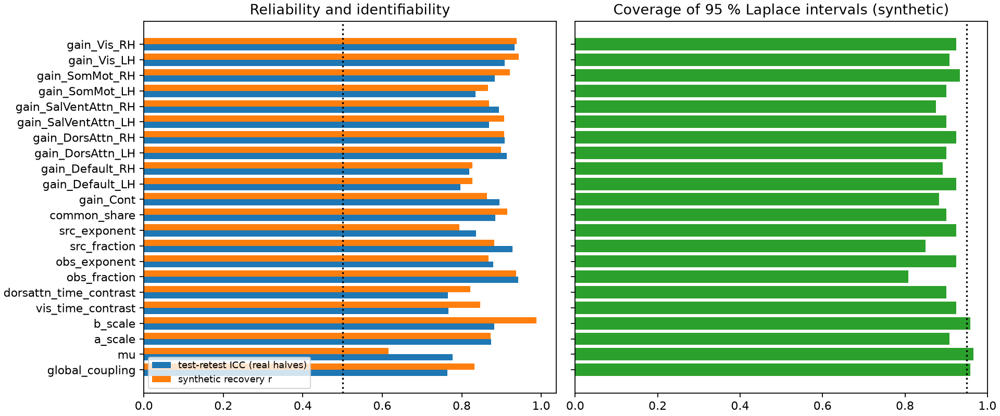
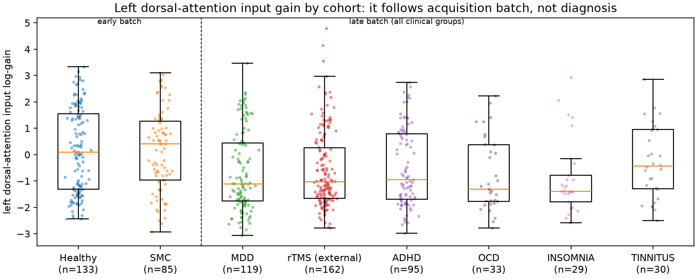
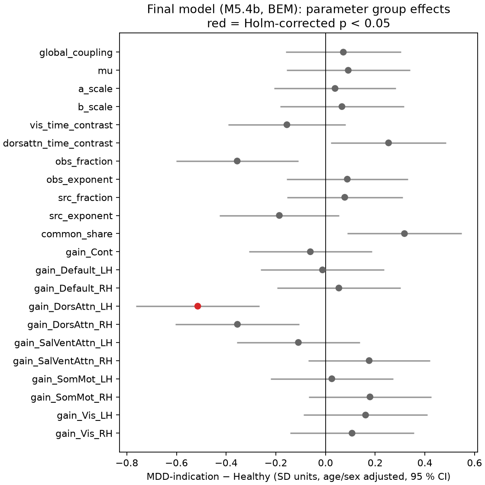
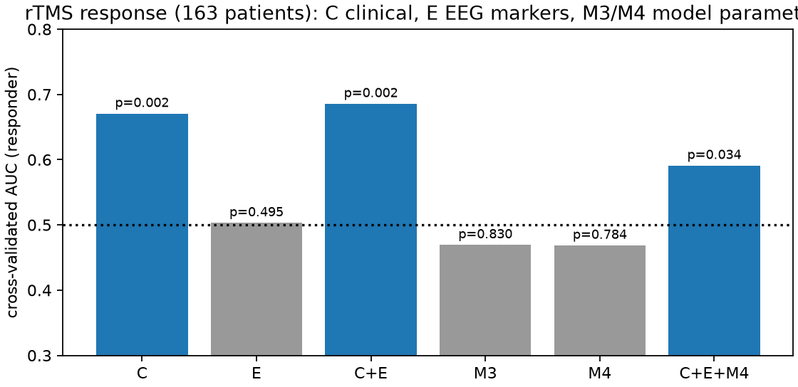

# Next steps carried out: external test, re-cleaned EEG, likelihood objective, rTMS outcomes

**Date:** 2026-09-25 · **Follows:** `docs/INDEPENDENT_AUDIT_2026-09-24.md` (the audit) · **Branch:**
`claude/audit-linear-regime`

This report covers the recommendations of the audit (§6) that were carried out in this session, in the order they
were done. Every number comes from files under `outputs/` produced by the scripts named in §9.

---

## 0. Bottom line

1. **The audit's model holds up on new patients.** Frozen before any external data were touched, M5.3 beat M5.1 on
   164 never-used rTMS patients by the pre-specified primary outcome: unseen total 0.806 → 0.698, paired −0.069
   [−0.083, −0.048]. The alpha-topography gain replicated in full (0.909 → 0.547).
2. **Re-cleaning the EEG helps.** A re-implementation of the TDBRAIN authors' artefact pipeline (EOG regression,
   EMG/jump/kurtosis/swing/blink detection, bridging, channel repair) raised the split-half reliability of theta
   topography from 0.71 to 0.89 and of theta/beta zero-lag coherence from 0.55/0.69 to 0.82/0.86. It halved frontal
   ocular power, and it keeps 252/262 development and 162/164 rTMS recordings.
3. **"Good fit" was a property of the old objective, not of the spectra.** Scored directly on unseen spectra, band
   topographies and coherence, M5.1 and M5.3 predict individual subjects *worse than the population average*.
   Zero-lag coherence is 4–12× worse; only the alpha peak frequency is better (§4).
4. **M5.4 fixes this with a proper likelihood, at a cost.** A complex-Wishart likelihood of the cross-spectrum
   (10 spatial modes, BEM lead field, the empirical population spectrum as a background component) fits unseen halves
   better than the population average: deviance 0.840 in development and 0.834 on the rTMS cohort, 99 % of subjects,
   noise ceiling ≈ 0.68.
   - The individual neural parameters matter: freezing them costs 0.09 for 99.6 % of subjects.
   - All 24 parameters are identifiable (synthetic r ≥ 0.5, median 0.88) and reliable (split-half ICC 0.76–0.94), with
     roughly calibrated posteriors.
   - The BEM beats the TVB formula for 82 % of subjects.
   - Costs: 62 % of predicted power is the population template, mean drive sits at its bound, and the alpha peak
     frequency and lagged connectivity are fitted worse than by M5.3 (§5).
5. **No EEG or model feature predicts rTMS response** (pre-specified; AUC 0.47–0.50). Only age and baseline severity
   do (AUC 0.67).
6. **The Healthy–MDD contrast is confounded by acquisition batch.** The "robust" parameter difference (lower left
   dorsal-attention input) appears equally in OCD, insomnia and ADHD patients recorded in the same late batch. It is
   absent in memory-complaint patients recorded in the early batch with the Healthy volunteers. Batch explains it
   (+0.42 SD, p = 0.001); diagnosis does not (depression −0.04, p = 0.63). Most of the dataset's Healthy–MDD EEG
   differences, including the lagged-connectivity effect the audit "restored", reproduce a batch difference estimated
   without a single depressed subject (r = 0.72–0.90).

**Net:** the modelling machinery is now sound: a validated likelihood, identifiable and reliable parameters, and an
honest external test. But the scientific question it was pointed at, Healthy vs MDD in TDBRAIN, cannot be answered
with this contrast. Stimulation work should wait for a batch-matched or within-subject design (§10).

---

## 1. What was done

| Audit recommendation | Status | Where |
|---|---|---|
| 0. Freeze the final model as the M5 baseline | done before any external data were touched: `docs/M53_FROZEN_MODEL.md`, `configs/m53_frozen/`; exact reproduction checked on the GPU | §2 |
| Untouched external test | done on 164 rTMS-treated MDD patients (never used before), with the pre-specified primary outcome | §2 |
| 6. Re-preprocess the EEG with EOG/EMG handling | done: re-implementation of the TDBRAIN authors' pipeline from the raw BDF files, eyes closed and eyes open | §3 |
| 3. Rebuild the objective (all bands, zero-lag structure, EMG) | done: complex-Wishart (Whittle) likelihood of the full cross-spectrum, muscle-prone channels marginalised above 20 Hz | §4, §5 |
| 4. Fix/tie non-identified parameters; posterior instead of MAP | done: speed, fast-generator ratio/fraction, noise τ fixed; limbic and control gains tied; Laplace posteriors from the Fisher information, calibrated on split halves | §5, §6 |
| 5. Both lead fields until zero-lag structure is scored | done: TVB and BEM fitted under the new objective | §5 |
| 7. Age/sex adjustment | done in every group comparison | §7 |
| 8. Gates against noise ceilings and replicability | done: same-subject ceilings and independent-subject replicability reported for every block | §3, §4 |
| 9. rTMS outcomes before any stimulation work | done: pre-specified prediction analysis (`docs/RTMS_PREDICTION_PLAN.md`) | §8 |
| Specificity of group differences (added) | done: four late-batch clinical groups and one early-batch clinical group fitted with the final model | §7 |
| 2. Competing lag mechanisms; 10. homotopic connections | not done (see §10) | — |

---

## 2. The frozen model on an untouched cohort

**Freeze.** The final model of audit §5.4 (M5.3) was frozen before any external recording was preprocessed:
population fits, bank recipes, fitting settings and the external-test protocol are in `docs/M53_FROZEN_MODEL.md`
and `configs/m53_frozen/` (commit `3ebda8a`). A reproduction run regenerated the banks on the GPU and refitted the
262 development subjects. It selected the same global state for 262/262 subjects, and the unseen-half scores were
identical (r = 1.000).

**Cohort.** TDBRAIN `MDD-rTMS`, session 1, eyes closed: 164 patients, disjoint from the development set and from the
consumed M5.1 holdout. They were preprocessed with the original EEGLAB script, changed only in its group
selection (`scripts/external/preprocess_tdbrain_rtms_restEC.m`), and all 164 passed its QC. Spectra came from the
unchanged M5 extraction. The transformer and pooled null were learned on all 262 development subjects.

**Result (pre-specified primary outcome: paired difference in unseen total, M5.3 TVB refined − M5.1):**

| Unseen / pooled null (median) | M5.1 bank | **M5.3 frozen, TVB** | paired change [95 % CI] | M5.3 frozen, BEM | paired change [95 % CI] |
|---|---|---|---|---|---|
| total | 0.806 | **0.698** | **−0.069 [−0.083, −0.048]** | 0.713 | −0.065 [−0.094, −0.037] |
| autospectrum | 0.498 | 0.438 | −0.046 [−0.058, −0.018] | 0.403 | −0.065 [−0.096, −0.043] |
| lagged coherency | 1.053 | 0.975 | −0.033 [−0.051, +0.008] | 0.976 | −0.045 [−0.077, −0.013] |
| alpha topography | 0.909 | 0.547 | −0.325 [−0.419, −0.256] | 0.801 | −0.066 [−0.170, +0.001] |
| subjects beating the null | 72 % | 80 % | | 79 % | |

The development result replicates on new patients with no loss of margin: the total improves by 0.069 in the
median (0.052 in development), and the alpha-topography gain is just as large. The prediction written into the freeze
document (M5.3 better, largest gain on topography) holds.

---

## 3. Re-cleaned EEG (v2)

**Pipeline** (`src/mdd_tvb/preprocess_v2.py`): a re-implementation of the TDBRAIN authors' automatic pipeline
(github.com/brainclinics/TDBRAIN), with their thresholds, working from the raw BDF files:
- bipolar EOG; 50 Hz notch; 0.5–100 Hz band-pass;
- EOG regression;
- detection of EMG bursts, jumps, kurtosis, extreme voltage swings and residual blinks;
- repair of bad or bridged channels from the authors' neighbour table.

Three deliberate deviations:
- the EOG regression uses one set of coefficients per recording, fitted and applied below 7 Hz, so frontal alpha that
  leaks into the EOG electrodes is not subtracted;
- channels dominated by tonic muscle activity are kept but flagged, instead of interpolated from neighbours that
  are usually also muscular; the likelihood drops their high frequencies (§4);
- spectra use only 4-s epochs that lie entirely in artefact-free time, and the two halves share no samples.

**Yield.** Eyes closed: 317/327 original recordings and 163/164 rTMS recordings usable. Of the 262 development
subjects, 252 remain. The 10 lost are 9 Healthy and 1 MDD: badly contaminated recordings, 8 of them from the earliest
Healthy batch (IDs 8795xxxx–8798xxxx), with up to 18 channels needing repair or kurtosis artefacts in 45 % of the
data. Median usable epochs per half: 24 (v1: 28). Eyes open: 307/327 and 154/164 usable.

**Data quality on the same 252 subjects** (`scripts/preprocess/compare_v1_v2.py`):

| | v1 (original) | v2 (re-cleaned) |
|---|---|---|
| split-half reliability, theta topography | 0.71 | **0.89** |
| split-half reliability, theta zero-lag coherence | 0.55 | **0.82** |
| split-half reliability, beta zero-lag coherence | 0.69 | **0.86** |
| split-half reliability, alpha / beta topography | 0.88 / 0.87 | 0.90 / 0.92 |
| split-half reliability, lagged alpha coherency / alpha frequency | 0.83 / 0.86 | 0.80 / 0.79 (fewer epochs) |
| frontal (Fp1/Fp2) vs central 2–4 Hz power | 4.9× | **2.3×** (ocular artefact halved) |
| 20–40 Hz slope, lateral vs central channels | −1.77 vs −3.60 | −1.86 vs −3.65 (tonic EMG remains; handled in the likelihood) |
| tonic-EMG channels flagged | — | 79 % of recordings have ≥ 1 (mostly Fp1/Fp2/F7/F8/T7/T8, as found in the audit) |
| bridged electrode pairs | — | 33 recordings |

**How replicable are the Healthy–MDD effects at all?** This is the ceiling for any group-effect gate. The median
correlation of age/sex-adjusted effects between two disjoint random halves of the subjects (≈ 126 per half):

| block | v1 | v2 |
|---|---|---|
| alpha topography | 0.66 | 0.67 |
| beta topography | 0.64 | 0.67 |
| beta zero-lag coherence | 0.64 | 0.60 |
| lagged alpha coherency | 0.56 | 0.54 |
| theta topography | 0.45 | 0.51 |
| full channel × frequency log power | **0.06** | **0.09** |
| lagged theta / beta coherency | 0.22 / −0.07 | 0.17 / −0.15 |

The channel × frequency power effect used by the M5.2 gate ("power group effect r ≥ 0.30") does not replicate
between independent halves of these subjects. A model cannot be required to reproduce it. The effects that do
replicate (alpha/beta topography, beta zero-lag coherence, lagged alpha coherency) turn out to be largely
acquisition-batch effects (§7.1). Replicable is not the same as disease-related.

---

## 4. What the earlier objective did and did not fit

The M5.1 score is a weighted distance between reliability-selected, PCA-projected, standardised features. The
audit showed it had become alpha-only. To see what the models actually predict, `scripts/m54/m54_evaluate.py`
scores the unseen half directly on interpretable blocks. Each score is the error relative to the pooled population
null (< 1 beats the population average). The same-subject first half gives the noise ceiling.

| Unseen / null, median | noise ceiling (own first half) | M5.1 | M5.3 TVB | M5.3 BEM |
|---|---|---|---|---|
| log spectrum, all channels × 2–40 Hz | 0.21 | 1.64 | 1.74 | 1.57 |
| theta / alpha / beta topography | 0.25 / 0.15 / 0.16 | 2.17 / 1.27 / 1.50 | 2.01 / 1.35 / 1.42 | 2.73 / 1.61 / 1.55 |
| zero-lag coherence θ / α / β | 0.39 / 0.20 / 0.28 | 11.3 / 5.7 / 11.6 | 7.4 / 4.1 / 8.1 | 3.1 / 2.7 / 3.6 |
| lagged coherency θ / α / β | 1.31 / 0.41 / 0.90 | 1.15 / 1.29 / 1.46 | 1.23 / 1.02 / 1.45 | 1.36 / 1.12 / 1.65 |
| alpha peak frequency (abs. error; null 0.66 Hz) | 0.04 | 0.44 (0.50 Hz) | 0.35 (0.37 Hz) | 0.40 (0.44 Hz) |

(development subjects, v1 data; the external cohort gives the same picture, `outputs/m54_eval/ext_v1_all`.)

**Both the old and the audited model predict individual spectra, band topographies and zero-lag coherence worse than
the population average.** The only exception is the alpha peak frequency. Zero-lag coherence, the dominant feature
of scalp EEG, is 3–12 times worse than the null. The good scores of audit §5.4 were good scores on a feature
space that throws most of the spectrum away. This is the strongest argument for changing the objective. The BEM
reproduces zero-lag coherence 2–3× better than the TVB formula, as the audit's volume-conduction analysis predicted.

---

## 5. M5.4: likelihood-based fitting

### 5.1 Design
Same physics as M5.3: the stable-regime analytic spectrum of the delayed dual Jansen–Rit network, the shared delayed
alpha drive, network × hemisphere input gains, a lead-field source background, and diagonal observation noise.
Changes (`scripts/m54/`, `src/mdd_tvb/whittle.py`):

- **Objective.** The complex-Wishart (Whittle) negative log likelihood of the binned cross-spectrum,
  `Σ_f ν [log det S_f + tr(S_f⁻¹ C_f)]`. It is evaluated in the coordinates each recording actually measures: after
  average reference and that subject's channel repairs, with fixed (Fp1/Fp2/F7/F8/T7/T8) and subject-flagged
  muscle channels marginalised above 20 Hz. The degrees of freedom were calibrated for our estimator: ν = 2.2 per
  4-s epoch (tests in `tests/test_whittle.py`). The subject's overall scale is profiled out analytically.
- **Parameters.** Speed, fast-generator ratio/fraction and noise τ are fixed at the population fit. Limbic and control
  gains are tied across hemispheres. 6 globals, 12 gains and 5–6 nuisance terms remain.
- **Inference.** A label-free population fit on the development first halves, then per subject: a certified bank (2,000
  Sobol states over the 6 free globals), Adam on gains and nuisances for the 16 best states, and 60 steps of full
  stability-constrained refinement. A Laplace posterior comes from the Fisher information of the Whittle likelihood
  plus Gaussian priors.
- **Scoring.** The Wishart deviance of the unseen second half, relative to the pooled population null (the mean
  normalised cross-spectrum of the training subjects, with its scale also fitted on the first half). The interpretable
  blocks of §4 are reported alongside.

### 5.2 What happened: three versions

| Unseen Wishart deviance / null (median) | development (252) | rTMS cohort (162) | share beating the null (dev) |
|---|---|---|---|
| **full 25-dim likelihood**, TVB lead | 1.244 | 1.279 | 12 % |
| full 25-dim likelihood, BEM lead | 1.069 | 1.082 | 30 % |
| **10 spatial modes**, TVB / BEM | 1.274 / 1.040 | 1.366 / 1.037 | 14 % / 44 % |
| **10 modes + population background**, TVB | 0.885 | 0.891 | 98 % |
| **10 modes + population background, BEM (final)** | **0.840** | **0.834** | **99 %** |
| ablation: final model with neural parameters frozen at the population fit | 0.956 | 0.956 | 87 % |
| noise ceiling: own first half as the prediction (10 modes) | 0.686 | 0.676 | |

1. **Full likelihood.** The model is worse than the empirical population mean even on the half it was fitted to (fit
   ratio 1.06 BEM, 1.21 TVB). A 23-parameter neural model cannot reproduce the full 25-dimensional spatial covariance
   of scalp EEG as well as the average of other people's recordings. On the interpretable blocks it fixed the
   spectrum (1.81 → 0.99) and zero-lag coherence (4–9 → 1.8–2.5) relative to M5.3, but lost topography and the alpha
   peak frequency. This is the first time the models were confronted with the whole cross-spectrum. It shows that
   the earlier "good fit" was never a fit of the spatial covariance.
2. **Ten spatial modes.** Restricting the likelihood to the 10 principal modes of the population cross-spectrum, as
   DCM for cross-spectra does (and as M5.1's features did), removes the noise-dominated directions. The BEM model is
   then at the null level (1.04), and the TVB formula remains clearly worse (1.27).
3. **Population background.** Adding the empirical population cross-spectrum as one more component, with a
   per-subject share, makes the model *nest* the null. The unseen score then measures what the individual neural
   fit adds beyond the population average. Result: 0.84 in development and 0.834 on the untouched rTMS cohort; 99 % of
   subjects beat the null. With the neural parameters frozen at population values the same model scores 0.956.
   Fitting them individually improves the unseen likelihood for **99.6 %** of subjects (paired −0.092
   [−0.109, −0.085]; external −0.087 [−0.110, −0.077]). Relative to the noise ceiling, the individual neural
   parameters deliver about 37 % of the achievable improvement over the population average, and the whole model
   about 51 %.

**Lead field.** Under the likelihood the question left open by the audit is settled. The fsaverage BEM beats the
TVB formula in every version: paired −0.045 [−0.054, −0.038] in development and −0.047 [−0.054, −0.039] externally
for the final model, better for 82–83 % of subjects. The BEM is the lead field for M5.4.

### 5.3 The final model on the interpretable blocks

| Unseen / null (median) | noise ceiling | M5.3 frozen (v2) | **M5.4 final, development** | **M5.4 final, rTMS cohort** |
|---|---|---|---|---|
| log spectrum | 0.20 | 1.81 | **0.77** | **0.79** |
| θ / α / β topography | 0.23 / 0.16 / 0.15 | 2.11 / 1.39 / 1.47 | 1.16 / **0.98** / **0.84** | 1.19 / **0.97** / **0.85** |
| zero-lag coherence θ / α / β | 0.39 / 0.21 / 0.29 | 8.0 / 4.4 / 8.7 | 1.19 / 1.12 / 1.04 | 1.30 / 1.12 / 1.07 |
| lagged coherency θ / α / β | 1.28 / 0.46 / 1.06 | 1.23 / 1.09 / 1.39 | 1.04 / 1.02 / 1.01 | 1.01 / 1.06 / 1.01 |
| alpha peak frequency (abs. error) | 0.15 Hz | **0.31 Hz** | 0.51 Hz | 0.60 Hz (null 0.74) |

- M5.4 is better than M5.3 on every block except alpha peak frequency. Every paired CI excludes 0, in development
  and externally.
- The full spectrum and the beta topography are now predicted better than the population average in both cohorts.
- Alpha topography is at the average level.
- Zero-lag coherence is within 4–30 % of the null instead of 4–9 times worse.
- Lagged coherency is at the null. The population background already contains the average lagged structure, so the
  fitted shared-drive share falls to a median of 2 %.
- The alpha peak frequency is worse than with M5.3. The likelihood weights the peak location less than M5.3's
  alpha-dominated features did.

**Group effects in the predictions** (unseen halves, correlation with the empirical Healthy–MDD effect / share of its
magnitude):

| | spectrum | α topo | β topo | θ topo | β zero-lag | α lagged |
|---|---|---|---|---|---|---|
| M5.3 | 0.67 / 0.93 | 0.77 / 0.66 | 0.76 / 0.53 | 0.28 / 1.01 | 0.41 / 0.49 | **0.73 / 0.54** |
| M5.4 final | 0.68 / 0.45 | **0.86** / 0.47 | **0.84** / 0.60 | **0.70** / 0.62 | **0.56** / 0.38 | 0.56 / **0.07** |

M5.4 reproduces the direction of the topographic and zero-lag effects better. It shrinks their magnitude, as a
partially pooled model should, and it loses the lagged-alpha effect that M5.3's shared drive carried.

**Caveats.**
- The population background carries a median 62 % of the power. M5.4 is "the population average plus individually
  fitted neural deviations", not a stand-alone generator of scalp EEG.
- The mean drive μ sits at its upper bound (0.40) in the population fit and for most subjects. The model wants
  something outside the certified box, so μ should not be interpreted.
- Six of the 16 blocks are still at or above the null.

### 5.4 What the fits look like

Figures from `scripts/m54/make_fit_figures.py` (`docs/figures/fit_examples_2026-09-26/`, numbers in `numbers.json`). All
comparisons use the unseen second halves. The example subjects are the development subjects at the 10th, 50th
and 90th percentile of the M5.4 unseen deviance ratio.

- **Average spectra** (`group_spectra.png`). M5.4 reproduces the mean measured spectrum in every channel group and
  in both cohorts: log-shape r = 0.992–0.997, against 0.93–0.98 for M5.3. That includes the 15–22 Hz beta shoulder
  and the fall-off above 25 Hz, which M5.1 and M5.3 overshoot.
- **Individual spectra** (`subject_spectra.png`). Shapes are right for most subjects, but strong, narrow alpha peaks
  come out too low. Median predicted / measured occipital peak height is 0.74 for M5.4 (32 % of subjects below
  half), 0.69 for M5.3 (21 %) and 0.68 for M5.1. This limitation is shared by every version: a stable,
  noise-driven linear model produces broader resonances than the sharpest measured alpha rhythms.
- **Scalp maps** (`topomaps_alpha.png`, `topomaps_beta.png`). Group alpha map r = 0.95 (M5.4) vs 0.88 (M5.3); single
  subjects 0.70–0.89 for both.
- **Spatial coherence** (`coherence.png`). The dependence of zero-lag coherence on electrode distance, the signature of
  volume conduction, is matched by M5.4. Alpha RMSE is 0.08, against 0.32 for M5.3 and 0.39 for M5.1. M5.1 and M5.3
  predicted almost independent channels.
- **EEG traces** (`eeg_traces.png`). Real EEG, the subject's M5.1 best candidate simulated with the JAX simulator,
  and samples of the fitted M5.3 and M5.4 models (exact: the linear-regime model's EEG is a Gaussian process with the
  predicted cross-spectrum; the sampler reproduces it, median power ratio 1.01). M5.1 generates a regular,
  clock-like rhythm (audit F1); M5.3 and M5.4 generate irregular noise-driven EEG like the real recording.
- **Decomposition** (`m54_decomposition.png`). The neural part carries the alpha peak. For the typical subject the
  population background supplies 54 % of the power; for the better-fitted subject the neural part supplies 71 %.
- **Group-difference maps** (`group_effect_maps.png`). The measured MDD − Healthy alpha map is reproduced by M5.4
  (r = 0.87) and M5.3 (0.81). It is reproduced even better (r = 0.92) by the late − early acquisition-batch map
  computed without any depressed subject (§7.1).

---

## 6. Identifiability, calibration and reliability of the parameters

Three independent checks for the final model (`outputs/m54_final/`, `outputs/m54_synth/`):

**Synthetic recovery.** 120 real subjects' fitted parameters were used as ground truth. Their exact model
cross-spectra were sampled as complex-Wishart halves with each subject's own degrees of freedom, channel repairs and
muscle masks, then refitted with the identical pipeline. **All 24 parameters recover with r ≥ 0.5 (median 0.88).**
Mean drive is the weakest (0.62). The audit's M5.3 recovered 19/27, and its failures (limbic, speed, fast-generator
parameters) are now tied or fixed. Laplace 95 % intervals cover the truth in a median 90 % of subjects: close to
nominal, slightly overconfident. The exception is the population-background share (17 %): the generator used one
all-development null, while the fits use fold-specific nulls.

**Split-half calibration on real data.** Each subject's two recording halves were fitted independently. For
calibrated posteriors, z = (θ₁ − θ₂)/√(sd₁² + sd₂²) has variance 1.
- **Gains:** var(z) is 0.7–1.6 for every gain.
- **Robust variance (MAD-based):** ≤ 1.3 for 21 of 22 parameters; the exception is the source-background fraction
  (2.2). These robust inflations are applied in §7.
- **Heavy tails:** the plain variance is 4–7 for the a/b time scales and the noise fractions. A few subjects move
  between local optima in these parameters.

Under the full 25-dimensional likelihood, the same check gave inflations of 1.5–40: misspecification shows up as
overconfidence.

**Test-retest reliability.** ICC(3,1) between the two halves is 0.76–0.94 for every parameter (gains 0.80–0.93).
This is high enough to use the parameters as subject-level measurements.



---

## 7. Healthy vs MDD-indication at the parameter level

Random-effects (PEB-style) group comparison of the final model's posteriors: each parameter regressed on
diagnosis, age and sex, with between-subject variance by REML and each subject's posterior variance inflated by the
split-half κ of §6. 252 development subjects (133 Healthy, 119 MDD-indication), Holm correction across 22
parameters (`outputs/m54_final/group_bem_m10pop/group_effects.csv`).

| parameter | MDD − Healthy (SD) | p | Holm p |
|---|---|---|---|
| **left dorsal-attention input gain** | **−0.51** | 5 × 10⁻⁵ | **0.001** |
| right dorsal-attention input gain | −0.36 | 0.005 | 0.10 |
| observation-noise fraction | −0.36 | 0.005 | 0.10 |
| shared-drive share | +0.32 | 0.007 | 0.13 |
| dorsal-attention time contrast | +0.25 | 0.03 | 0.57 |
| every other parameter | \|d\| ≤ 0.19 | ≥ 0.13 | 1.0 |

The left dorsal-attention gain effect has now appeared in every model version:
- intermediate M5.3: −0.33;
- final M5.3: −0.35;
- M5.4 with the full likelihood: −0.48;
- M5.4 final: −0.51.

It was also pre-specified and replicated in the rTMS cohort (H3, §8). It is well identified (synthetic r = 0.90) and
reliable (ICC 0.91). At the scalp it tracks relative power at left centro-parietal P3/CP3 against the lateral
frontal and temporal channels (r = 0.55–0.57 in the α and β bands). Adjusting for per-subject muscle indices
(20–40 Hz slope, number of tonic-EMG channels) changes nothing (MDD −0.52, rTMS −0.49 SD, p ≈ 2 × 10⁻⁵).

**But it is not specific to depression (exploratory).** I fitted the final model to four other TDBRAIN groups recorded
in the same period as the MDD patients: 95 adult ADHD, 33 OCD, 29 insomnia and 30 tinnitus patients. All were cleaned
and scored like the rTMS cohort. The model fits them just as well (unseen deviance 0.857, 99 % beat the null).
Differences from Healthy, age and sex adjusted, in SD:

| group | n | left dorsal-attention gain vs Healthy |
|---|---|---|
| MDD (development) | 119 | −0.51 [−0.75, −0.28] |
| MDD (rTMS cohort) | 162 | −0.48 [−0.70, −0.27] |
| insomnia | 29 | −0.67 [−1.05, −0.29] |
| OCD | 33 | −0.61 [−0.97, −0.25] |
| adult ADHD | 95 | −0.44 [−0.69, −0.19] |
| tinnitus | 30 | −0.29 [−0.66, +0.09] |

The pooled non-depressed clinical groups do not differ from the depressed groups (+0.01 SD, p = 0.87). The gain does
not track depression severity (BDI, p = 0.14). The effect is therefore either a transdiagnostic "clinical sample"
difference or an acquisition-batch difference: most Healthy recordings come from an earlier batch than all the
clinical ones.
- **Within the clinical era:** the 15 late-recorded Healthy subjects sit close to the early Healthy (difference
  −0.15 SD, p = 0.58). Clinical groups sit 0.44 SD below them (p = 0.07). This is weakly in favour of a clinical effect,
  but underpowered.
- **Decisive test:** the 85 patients with subjective memory complaints (SMC) are a clinical group recorded in the same
  early batch as the Healthy volunteers (IDs 8796xxxx–8797xxxx). Their gain equals the Healthy level: +0.03 SD
  [−0.25, +0.32], p = 0.82; +0.19 SD, p = 0.33, against age-matched Healthy ≥ 50 years.
- **Joint model** over all 686 subjects: early acquisition batch (ID < 88000000) **+0.42 SD [+0.18, +0.65],
  p = 0.001**; being a clinical patient −0.09 [−0.33, +0.16], p = 0.49; depression −0.04 [−0.21, +0.13], p = 0.63.
- **The raw EEG shows the same step.** Relative left centro-parietal power (P3/CP3 minus F7/F8/T7/T8) is +0.59 SD
  (α) and +0.54 SD (β) higher in the early batch (p < 0.001), with no clinical or depression effect.

Subject IDs are the only acquisition-time proxy in the participants table, and all but 15 Healthy recordings (and
all SMC recordings) come before ID 88000000. The step most plausibly reflects a change in equipment, cap or
protocol between acquisition batches.

**Consequence.** The one "robust" parameter difference is an acquisition-batch effect confounded with diagnosis. No
data here support a depression-specific parameter difference. H3 "replicated" because the rTMS cohort was recorded
in the same late batch as the development MDD group.

### 7.1 The batch confound affects every Healthy–MDD comparison in this dataset

The batch effect can be estimated without any depressed subject: late-batch non-depressed patients (ADHD, OCD,
insomnia, tinnitus and the 15 late Healthy) against early-batch Healthy + SMC, adjusted for age and sex. Compared
with the development Healthy–MDD effect on the same v2 features:

| feature | r(MDD − Healthy effect, batch effect) | batch effect size / MDD effect size | MDD vs batch-matched non-depressed patients: r with naive effect / relative size |
|---|---|---|---|
| α topography | **+0.90** | 0.93 | +0.59 / 0.29 |
| β topography | **+0.81** | 0.80 | +0.64 / 0.44 |
| θ topography | +0.55 | 1.10 | +0.48 / 0.46 |
| α zero-lag coherence | +0.72 | 1.24 | +0.24 / 0.38 |
| β zero-lag coherence | +0.78 | 1.01 | +0.34 / 0.47 |
| **α lagged coherency** | **+0.90** | 0.78 | **+0.03** / 0.26 |
| full log spectrum | +0.53 | 1.12 | +0.47 / 0.67 |

Most of the Healthy–MDD differences the M5.x group-effect gates were built on reproduce the acquisition-batch
difference, in pattern and in size. That includes the lagged-alpha-connectivity effect whose "restoration" the audit
reported (audit §5.2). Compared with batch-matched non-depressed patients, the depressed patients' residual effects
are a quarter to two-thirds of the naive size, and for lagged alpha coherency the naive pattern disappears (r = 0.03).
The non-depressed patients are not healthy, so this residual is a depression-versus-other-patients contrast, not a
clean disease effect. But it is the only batch-matched estimate the dataset allows.




---

## 8. Does any of this predict rTMS response?

Pre-specified in `docs/RTMS_PREDICTION_PLAN.md` before any outcome association was computed. 163 patients with v2
spectra (96 responders). L2 logistic regression, inner CV for regularisation, stratified 5-fold CV repeated 50×,
label-permutation p values (500 permutations).

| Feature set | features | CV AUC | balanced accuracy | permutation p | BDI change: out-of-fold ρ |
|---|---|---|---|---|---|
| C: age, sex, BDI_pre, protocol code | 7 | **0.671** | 0.629 | **0.002** | 0.25 |
| E: 8 standard EEG markers (FAA, frontal θ, IAF, posterior α, frontal β, θ/β, α reactivity, aperiodic exponent) | 8 | 0.503 | 0.493 | 0.50 | −0.04 |
| C + E | 15 | **0.686** | 0.657 | **0.002** | 0.24 |
| M3: frozen M5.3 parameters | 19 | 0.469 | 0.476 | 0.83 | −0.17 |
| M4: M5.4 final parameters | 23 | 0.469 | 0.465 | 0.78 | −0.17 |
| C + E + M4 | 38 | 0.591 | 0.566 | 0.034 | 0.15 |

- **H1 (model parameters predict response): not supported.** Neither model's parameters predict response (AUC 0.47,
  p ≈ 0.8), and neither do the eight standard EEG markers (AUC 0.50).
- **H2 (they add to clinical + EEG): not supported.** Adding the M5.4 parameters to clinical + EEG features lowers
  the AUC (0.686 → 0.591; block-permutation p = 0.62).
- **What does predict response:** the clinical variables. An exploratory logistic model attributes this to age
  (older → less response, p = 0.005) and baseline BDI (higher → less response, p = 0.016). The protocol code is not
  significant after adjustment.
- This matches the literature: EEG predictors of rTMS response have not replicated in consortium re-analyses.

**Deviation from the plan.** The plan named M4 as the TVB Whittle fit. By the time M4 was computed, the objective
had been revised (§5) and the BEM chosen on development data only. The BEM version of the final model was used. The
TVB version of the same model gives the same qualitative picture on the spectral metrics, and it was not tested
separately for prediction.



**H3: the group difference, replicated in a new MDD sample.** The only parameter difference that survived the audit's
model change was a lower left dorsal-attention input gain in MDD (§5.6 of the audit). With the frozen M5.3
parameters, it is again lower in the 164 rTMS patients than in the development Healthy group: −0.43 SD
[−0.65, −0.21], one-sided p = 8 × 10⁻⁵, age/sex adjusted. The rTMS patients do not differ from the development MDD
group (−0.06 SD, p = 0.59). The parameter shows no recording-era trend within the Healthy group (r = −0.09 with
subject ID). Caveats: the Healthy group is re-used, so this is semi-independent. Healthy recordings are on average
older than MDD recordings, so an era effect cannot be fully excluded. **§7 shows that the same reduction is present
in non-depressed clinical groups, so H3's success does not mean the difference is specific to depression.**

---

## 9. Reproducibility

```bash
# freeze + external test (M5.3 vs M5.1)
matlab -batch "run('scripts/external/preprocess_tdbrain_rtms_restEC.m')"   # original EEGLAB cleaning, rTMS cohort
.conda/python.exe scripts/external/extract_external_spectra.py
.conda/python.exe scripts/external/run_m51_external.py                     # M5.1 comparator + all-development transformer
#   GPU: scripts/linear/kaggle/mddtvb_external_m53.py (banks from configs/m53_frozen, reproduction, external fits)
# re-cleaning (v2) and data-quality comparison
.conda/python.exe scripts/preprocess/run_preprocess_v2.py --cohorts dev rtms controls --tasks restEC restEO
.conda/python.exe scripts/preprocess/compare_v1_v2.py
# interpretable evaluation of any run with predictions.npz
.conda/python.exe scripts/m54/m54_evaluate.py label=run_dir ... --emp-dir <emp> [--null-emp-dir <dev emp>]
# M5.4 (GPU; kernels generated by scripts/m54/kaggle/make_kernels.py from mddtvb_m54_template.py)
.conda/python.exe scripts/m54/m54_population.py --lead bem --modes 10 --emp-dir outputs/preproc_v2/dev_restEC/empirical ...
.conda/python.exe scripts/linear/build_analytic_bank.py --lead bem --samples 2000 --half-width 1.2 --fix speed_mm_per_ms fast_ratio fast_fraction noise_tau_ms ...
.conda/python.exe scripts/m54/m54_fit.py --lead bem --modes 10 --pop-background [--swap-halves | --freeze-neural | --null-emp-dir ...]
.conda/python.exe scripts/m54/m54_synthetic.py generate|summarise --pop-background ...
.conda/python.exe scripts/m54/m54_group.py --first <dev fits> --second <swap fits>
# rTMS prediction (pre-specified)
.conda/python.exe scripts/rtms/predict_response.py [--only M4 C+E+M4 --m4 <external fits>]
.conda/python.exe scripts/m54/batch_confound.py                              # specificity and acquisition-batch analysis (§7)
.conda/python.exe scripts/m54/make_next_steps_figures.py
```

Kaggle jobs used (private): `mddtvb-external-m53`, `mddtvb-m54-tvb`, `mddtvb-m54-bem`, `mddtvb-m54b-tvb`,
`mddtvb-m54b-bem`, `mddtvb-m54-synth`, `mddtvb-m54-ctrl`, `mddtvb-m54-smc`. Private datasets: `mdd-tvb-linear-bundle`,
`mdd-tvb-linear-code`, `mdd-tvb-external` (the rTMS spectra, the v2 spectra of all cohorts, and the subject lists).
Downloaded results are under `outputs/external/m53`, `outputs/m54_kaggle_*`, `outputs/m54b_kaggle_*`,
`outputs/m54_synth`, `outputs/m54_ctrl`; local analyses under `outputs/m54_eval`, `outputs/m54_final`,
`outputs/m54b_local`, `outputs/rtms_prediction`, `outputs/preproc_v2`. Tests: `tests/test_whittle.py` (6 tests)
plus the existing suite.

---

## 10. What is left and what I recommend next

**The design problem comes first.**
0. **Stop using TDBRAIN Healthy vs MDD as the disease contrast.** In this dataset it is dominated by acquisition batch
   (§7.1). Any modelling claim about depression needs one of:
   - a batch-matched comparison: MDD against other late-batch patients, or the 15 late Healthy volunteers, with batch
     as a covariate;
   - an external healthy sample recorded on the same system;
   - a within-subject design.

   The rTMS cohort already offers a within-subject design: 9–11 patients have a second session, and all have BDI
   change. Group-effect gates (M5.1–M5.3 and the audit) should be re-read in this light. A gate passed by reproducing
   a batch difference is not evidence about depression.

**What remains open in the model.**
1. **The model is not yet a stand-alone generator of scalp EEG.** Scored on the whole cross-spectrum, the neural
   model alone does not beat the population average. With the population background it does, and its individual
   parameters carry real, reliable information. But 62 % of the predicted power is the population template. The
   biggest remaining gap is spatial: zero-lag coherence and theta topography stay at or above the null. Next
   candidates, in order:
   (a) fit the BEM with orientation-aware parcel aggregation instead of uniform-sign averaging (audit §F5);
   (b) replace the 14 input-noise gains by a smooth cortical field (e.g. spherical harmonics or a few gradient
   modes), so the source covariance can take realistic shapes;
   (c) a thalamic node with its own dynamics, instead of the rigid shared-drive origin (recommendation 2 of the
   audit, not done here).
2. **Mean drive at its bound.** The likelihood pushes μ to the upper edge of the certified box. Test whether a
   higher-drive, still-stable regime exists (JR has a second stable branch) or whether a different excitability
   parameterisation is needed. Do not interpret μ until then.
3. **Alpha peak frequency.** M5.3's alpha-dominated features predicted the individual alpha frequency better
   (0.31 vs 0.51 Hz). A frequency-weighted likelihood, or an explicit alpha-peak term, would combine both strengths.
4. **Lagged connectivity** is carried by the shared drive in M5.3 but absorbed by the population background in
   M5.4. Refit the shared-drive origin/speed per subject (or add the thalamic node) before any claim about
   directed coupling.
5. **Eyes-open data are cleaned and on disk** (307/327 and 154/164 usable) but only used for alpha reactivity. A joint
   EC/EO fit, with shared anatomy and a state-specific drive, is the strongest remaining constraint on excitability
   parameters.

**On stimulation work (M6–M8).**
- The rTMS test is the honest bar, and it is not met. Neither model's parameters nor standard EEG markers predict
  response. Age and baseline severity do.
- Before simulating stimulation, the model should at least predict something about the treated patients that the
  clinical variables do not.
- The one "robust" neural finding, reduced left dorsal-attention input, turned out to be an acquisition-batch effect
  (§7). There is currently no model-derived, depression-specific target.
- If the goal remains model-guided rTMS, the useful next experiment is prospective: simulate the delivered protocol
  in each patient's fitted model and test whether the simulated change predicts BDI change better than age and BDI_pre.
  The data to do this retrospectively are on disk.

**Housekeeping.**
- Adopt M5.4 (BEM, 10 modes, population background) as the default spectral model and keep M5.3 frozen as the
  comparator.
- Report every group gate next to its independent-sample replicability (§3). Drop the channel × frequency power
  gate, which does not replicate at this sample size.
