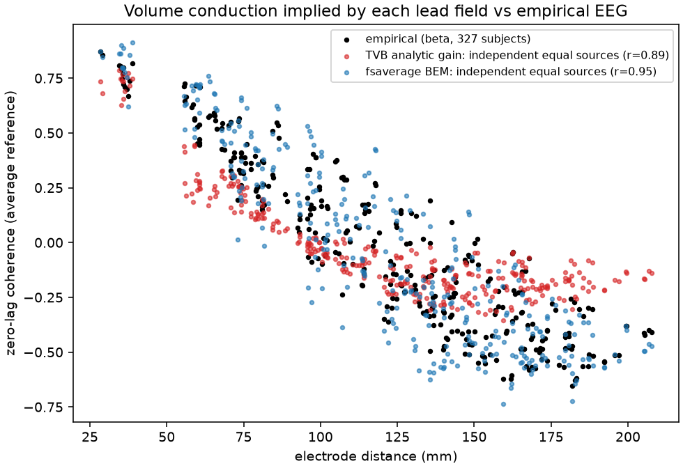
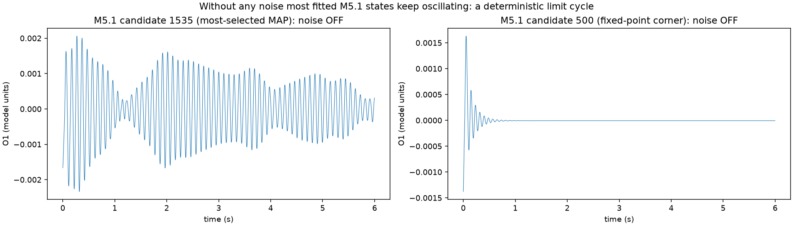
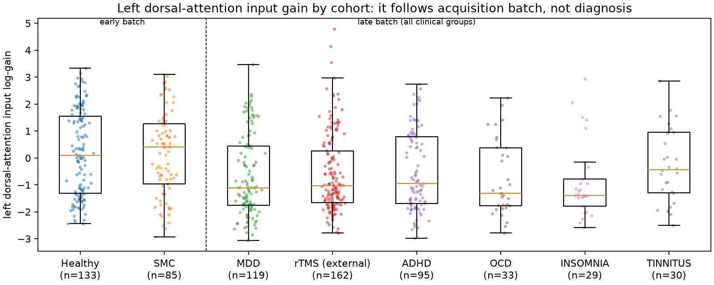

# How the MDD–TVB project works: a plain-language primer

**Companion to** `notebooks/learn_01_spectral_model_fitting.ipynb`. The notebook shows each idea working on real
data; this primer explains the ideas in words. Each section names the notebook section (§) and the slides where the idea
appears. "progress_v2" means the current deck; "v2-o" means the saved full version `slides/progress_v2-o.pptx`.

---

## 1. The question

Depression is diagnosed from symptoms, not from brain measurements. The project asks:

1. Can a **model of the brain** be tuned to each person's **resting EEG**, so that the tuned settings describe that person's
   brain dynamics?
2. Do those settings **differ between depressed and healthy people**?
3. Could the tuned models later help **choose or predict TMS treatment**?

Everything below is about doing step 1 properly, because steps 2 and 3 are only as good as step 1.

---

## 2. The data: what is being fitted

**EEG** records tiny voltages on the scalp from 26 electrodes, here with eyes closed and at rest, for about 2 minutes
per person (TDBRAIN dataset).

**Spectrum (notebook §2).** Instead of the raw wiggles, the project uses how much power the signal has at each frequency,
from 2 to 40 Hz. *Analogy:* the bars of a music equaliser, showing how loud each pitch is. Resting EEG with eyes closed has a
big bump near 10 Hz: the **alpha rhythm**.

**Cross-spectrum.** The same, but for every *pair* of electrodes as well: how strongly two electrodes move together at each
frequency, and with what time shift. For 26 electrodes that is a 26 × 26 table per frequency. This table is what the model
must reproduce.

**Coherence, zero-lag and lagged (notebook §12).** Two electrodes can move together for two different reasons:

- *zero-lag*: they pick up the same source at the same instant, because currents spread through the head;
- *lagged*: one region drives another through nerve fibres, so the activity arrives slightly later.

Only the lagged kind says something about brain regions talking to each other.

**Two halves.** Every recording is split in time. The **first half is used for fitting**; the **second half is hidden** and
used only for testing. *Analogy:* practice questions vs the real exam.

---

## 3. The model

**A neural mass (notebook §1).** One patch of cortex is described not neuron by neuron but as three interacting
*groups*: pyramidal cells, excitatory helpers and inhibitory helpers (the **Jansen–Rit** model). Excitation and slower
inhibition chase each other around a loop, which makes the patch ring at about 10 Hz.
*Analogy:* **a bell.** Random input from the rest of the brain is rain hitting the bell. The bell answers at its own pitch,
irregularly, louder and softer in turn, as resting EEG does.

**A whole brain (TVB).** The Virtual Brain puts 200 of these patches (the Schaefer-200 brain regions) on a map of real
white-matter connections. A signal leaving one region reaches the others after a **conduction delay** set by the fibre length.
*Analogy:* 200 bells joined by strings of different lengths.

**The lead field: from brain to scalp (notebook §12).** Each electrode hears many regions at once, because currents spread
through brain, skull and scalp. The **lead field** is the table of how strongly each region shows up at each electrode.
It comes from a **head model**: TVB's simple formula, or a realistic **BEM** (boundary element model) with skull and scalp layers.
*Analogy:* **microphones in a room** with several speakers. Every microphone picks up every speaker. Two microphones look
"related" even if the speakers are independent; that is zero-lag coherence. But an echo from one speaker to another creates a
time shift that mixing alone cannot produce; that is lagged coherence.

*The realistic BEM head model reproduces how strongly neighbouring electrodes co-vary much better than TVB's simple formula (audit; progress_v2 slide 7).*

**Knobs (parameters).** Things the fit may change for each person, for example:

- how fast the synapses are (time scales `a`, `b`);
- how strongly each brain network is driven (**network gains**: visual, somatomotor, dorsal attention, default mode, …);
- the overall coupling between regions;
- the mean drive `μ`;
- how much background activity there is.

---

## 4. Bell or clock: the first big problem found

A model can produce a 10 Hz rhythm in two ways (notebook §3):

- **bell (stable).** It rings only because it is being hit. Switch the input off and it falls silent;
- **clock (limit cycle).** It oscillates by itself, regular as a metronome, even with no input.

Resting EEG behaves like a bell. The audit found that the original fits (**M5.1**) were **clocks in 318 of 327 people**
(progress_v2 slide 4). The model produced a regular rhythm of its own, and most of the rest had to be explained by artificial
"sensor noise".

*Left: the most common M5.1 best fit keeps oscillating after the noise is switched off (a clock). Right: a rare stable setting that falls silent (a bell). Audit; progress_v2 slide 4.*

The test is mathematical as well as visual. At the model's resting point, the **eigenvalues** say whether a small kick dies
away (negative: bell) or grows (positive: clock). From M5.3 on, every fitted model is **certified** to be a bell.

The point where a bell turns into a clock is a **Hopf bifurcation**. In a single Jansen–Rit column it sits at a drive of
p ≈ 316: more drive pushes the cells towards saturation, which weakens the feedback and damps the ringing; less drive
does the opposite until the damping reaches zero (notebook §3).

---

## 5. Computing the prediction: simulation vs the exact formula

**M5.1 simulated** the brain model with random input, many times, and stored about 2,000 pre-computed parameter sets (a
**bank**). Fitting meant choosing the best entries from that bank. That is slow, noisy and coarse: about 1.7 settings per knob
(progress_v2 slide 7).

**M5.3 computes the expected spectrum exactly** (notebook §4; progress_v2 slide 9). In the bell regime the model responds to
small inputs like a linear filter, so its spectrum follows from a formula:

> predicted cross-spectrum = lead field × brain's frequency response × input noise × (the same, mirrored)

This has no randomness, is about 50× faster on a GPU, and can be differentiated, so each person's knobs can be tuned
continuously. It matches the full simulation almost perfectly (r = 0.9997). *Analogy:* instead of recording a bell many times to
learn its sound, you compute its sound from its shape and material.

---

## 6. Fitting: turning the knobs

**Likelihood (notebook §7).** A score for how well a guessed spectrum explains the measured one. Even a perfect model would not
match exactly, because each measured spectrum averages only a limited number of 4-second windows. The likelihood says how
surprising the data would be if the guess were true. M5.4 uses the statistically correct version for spectra (the
**Whittle / complex-Wishart likelihood**), which scores *ratios*, so errors at 2 Hz and at 40 Hz count equally.

**Prior (notebook §8).** What is believed before seeing the data, for example "alpha speed is roughly normal". It keeps knobs in
sensible ranges when the data are weak.

**Best fit (MAP).** The knob setting that best balances likelihood and prior. An optimiser walks downhill to it.

**Error bars: the Laplace approximation (notebook §9).** Around the best fit, the score looks like a bowl. A steep bowl means a
precisely determined knob; a flat bowl means a poorly determined one. Fitting a parabola to the bowl gives each knob an error bar,
and the tilt of the bowl gives the **trade-offs** between knobs.

**Profiled scale.** The overall loudness of the EEG depends on skull, skin and amplifier, not on the brain. So it is not a
knob: for every shape its best value is computed and set aside.

**Spatial modes.** Instead of all 26 channels separately, M5.4 scores the 10 strongest spatial patterns, which is the same idea as
in DCM. Weak, noise-dominated directions are left out.

**Population background.** M5.4 adds the *average* cross-spectrum of other people as an extra ingredient, with a per-person share.
It made the model beat the average, but it also means a large part of each prediction (median 62 % of power) is borrowed rather
than produced by the brain model (v2-o slide 29).

---

## 7. Testing: is the fit any good, and can the knob values be trusted?

**Predicting the hidden half (notebook §10).** Each fitted model predicts the person's unseen second half. Two references
make the score meaningful:

- **population average**: predict "the average person". Needs no fitting; the baseline to beat.
  *Analogy:* forecasting tomorrow's weather as the average for this date;
- **ceiling**: the person's own first half. No model can be expected to do better.

The main score is **error of the model ÷ error of the population average**. Below 1 means the individual model beats the
average. M5.4: 0.84 in development and 0.83 in new patients (ceiling 0.69).

**Recovery (notebook §11).** Make fake data from the model with known knob values, refit, and see whether the knobs come back.
A knob that does not come back cannot be interpreted, however good the fit looks. *Analogy:* hide an object and check whether
the search finds it. M5.3 recovered 19 of 27 knobs (progress_v2 slide 12); M5.4 recovered 24 of 24.

**Calibration and repeatability.**

- **Calibration**: do the 95 % error bars contain the truth about 95 % of the time? (M5.4: 90 %.)
- **Test–retest (ICC)**: do the two halves of the same recording give the same knob values? (M5.4: 0.76–0.94.)

**External test and pre-registration.** M5.3 was **frozen** (written down and committed) before it was tested on 164 rTMS
patients nobody had used, with the expected result stated in advance (progress_v2 slides 13–14). This guards against fooling
oneself by adjusting the method after seeing the results.

---

## 8. Comparing groups: and how a batch effect fooled every model

**Effect size in SD.** A difference between groups measured in units of the normal spread between people. 0.5 SD is moderate;
0.2 SD is small.

**Multiple testing (Holm correction).** Testing 22 knobs at once will produce some "significant" results by luck. The
correction raises the bar accordingly.

**The batch confound.** In TDBRAIN, almost all healthy volunteers were recorded in an early period and all patients later.
Anything that changed between the periods (equipment, procedure, staff) looks like a difference between healthy and ill
people. *Analogy:* two groups photographed with two different cameras; a colour difference may be the camera, not the people.

The one "robust" finding, a lower **left dorsal-attention gain in depression** (−0.5 SD, present in every model version), turned
out to follow the recording period. Patients with OCD, insomnia or ADHD from the late period look the same as depressed
patients, while memory-clinic patients from the early period look like the healthy volunteers.

*The early-period groups (healthy, memory complaints) sit higher than the late-period clinical groups, whatever their diagnosis: the effect follows the recording period, not depression (v2-o slides 31–34).*

**Heterogeneity (I²).** When the same comparison is made in several datasets, I² says how much they disagree beyond chance.
0 means consistent; 0.8 means the datasets tell different stories. The best candidate depression effect across the three new
datasets had I² = 0.82 (progress_v3).

---

## 9. The model versions in one table

| version | what it was | what changed | outcome |
|---|---|---|---|
| **M5.1** | bank of ~2,000 simulated states, feature-based score | – | passed most of its own gates, but fits were clocks, the score had silently become alpha-only, and plain spectra were predicted worse than the average |
| **M5.2** | M5.1 with a realistic (BEM) head model | head model | looked worse, but the test was confounded by M5.1's problems |
| **M5.3** | exact spectrum of a certified bell, fitted continuously | formula instead of simulation; shared delayed alpha drive; left/right network gains; background activity | better on the same tests, confirmed in 164 new patients; still worse than the average on plain spectra and coherence |
| **M5.4** | M5.3's model scored with a proper likelihood, BEM head model, 10 spatial modes, population background, error bars | the scoring and inference | beats the average for 99 % of people, knobs recoverable and repeatable; relies on the population template; no individual beta |

---

## 10. Where DCM fits in

**Dynamic Causal Modelling (DCM)** is the established method (SPM, University College London) that fits neural-mass models to
EEG spectra. It does this for a few brain sources and estimates the connections between them. Its recipe is the one above:
linearise, compute the predicted spectrum, score it with a likelihood plus priors, and take error bars from the curvature.

M5.4 borrows that recipe but applies it to a 200-region TVB brain with **fixed** wiring, and judges models by **predicting the
hidden half** rather than by DCM's "model evidence". It is best described as **DCM-style spectral fitting of a whole-brain
model**, not DCM itself (notebook §14).

---

## 11. Where the project stands, in one paragraph

The machinery now works: a fast, exact, certified-stable model; a proper likelihood; knobs that are recoverable, repeatable and
honestly uncertain; and it transfers to three other laboratories' EEG systems. The scientific question has no positive answer
in these data. TDBRAIN's healthy-vs-depressed contrast is mostly a recording-batch effect. Across four independent sources no EEG
feature or knob separates depressed from healthy people consistently, and nothing in resting EEG predicts rTMS response beyond
age and severity. The model also lacks individual beta, frontal theta and non-sinusoidal alpha, which need a new model component.
Details: `docs/PROJECT_STATUS_2026-09-27.md`.

---

## 12. Glossary

| term | plain meaning | where |
|---|---|---|
| alpha, beta, theta | rhythms near 8–12 Hz, 13–30 Hz, 4–7 Hz | §2 |
| batch confound | a technical difference between recording periods that looks like a group difference | §8 |
| bank | M5.1's library of pre-simulated parameter sets | §5 |
| BEM | realistic head model with brain, skull and scalp layers | §3 |
| bell / clock (limit cycle) | rhythm driven by input / rhythm that runs by itself | §4, notebook §3 |
| Hopf bifurcation | the point where a bell turns into a clock: damping reaches zero | §4, notebook §3 |
| ceiling | the best achievable prediction: the person's own first half | §7, notebook §10 |
| coherence (zero-lag / lagged) | how two channels co-vary at one frequency, without / with a time shift | §2, notebook §12 |
| cross-spectrum | power of every channel and co-variation of every pair, per frequency | §2 |
| deviance | likelihood-based distance between prediction and data (0 = perfect) | notebook §7, §10 |
| DCM | the standard method for fitting neural-mass models to EEG/MEG | §10 |
| effect size (SD) | group difference in units of the normal spread between people | §8 |
| eigenvalue | how fast a small kick decays or grows, and at what pitch | §4, notebook §3 |
| external test | testing on data never used for development | §7 |
| Holm correction | correction for testing many things at once | §8 |
| I² | how much datasets disagree beyond chance (0 = consistent) | §8 |
| ICC (test–retest) | agreement of the same measurement taken twice | §7 |
| Jansen–Rit model | the three-population neural mass used for each region | §3, notebook §1 |
| Laplace approximation | error bars from the curvature of the score at the best fit | §6, notebook §9 |
| lead field | how much each brain region shows up at each electrode | §3 |
| likelihood (Whittle) | how probable the measured spectrum is under a guessed one | §6, notebook §7 |
| linearisation / transfer function | treating small fluctuations as a linear filter; its gain per frequency | §5, notebook §4 |
| MAP (best fit) | the knob setting that best balances data and prior | §6, notebook §8 |
| network gain | how strongly a brain network (visual, attention, …) is driven | §3 |
| population average (null) | predicting "the average person": the baseline to beat | §7 |
| population background | M5.4's borrowed average spectrum, with a per-person share | §6 |
| pre-registration | writing down the method and expected result before testing | §7 |
| prior / posterior | belief before / after seeing the data | §6, notebook §8 |
| profiled scale | overall loudness handled separately, not as a knob | §6 |
| recovery | refitting fake data with known truth to check that knobs come back | §7, notebook §11 |
| spatial modes | the strongest spatial patterns, used instead of all channels | §6 |
| TVB | The Virtual Brain: neural masses on a real connection map | §3 |
| volume conduction | instantaneous spread of currents through the head, mixing sources | §3, notebook §12 |
