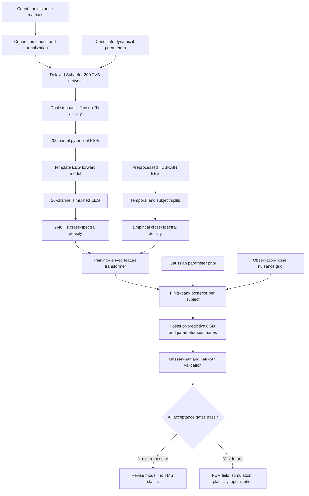

# MDD–TVB Whole-Brain Modeling Project

## Technical status report and forward plan

**Report date:** 2026-09-18

**Repository:** `mdd-tvb`
**Current implementation status:** M1–M4 complete; M5.1 production complete but not scientifically accepted; stimulation optimization blocked

---

## 1. Executive summary

This project is building a mechanistic, whole-brain framework for eventually
studying and optimizing TMS in depression. The intended chain is:

1. start from an existing Schaefer-200 structural connectome;
2. simulate whole-brain neural-mass dynamics with TVB and Jansen–Rit models;
3. project regional activity to the 26-channel TDBRAIN EEG montage;
4. fit each subject independently to resting-state EEG;
5. verify that the fitted models predict unseen EEG and retain empirically
   observed Healthy–MDD differences;
6. only then introduce a realistic TMS electric-field model, stimulation,
   plasticity, and protocol optimization.

The project has successfully implemented and validated the computational core,
including a GPU-accelerated simulator and a leakage-controlled subject-fitting
pipeline. The final M5.1 run evaluated 2,048 candidate dynamical states, three
stochastic replicates per state, and 60 analysed seconds per replicate. All
simulations were finite and no simulations failed.

The current model is meaningfully fitted, but it is not yet adequate for TMS
targeting. On 65 held-out subjects, the fitted models achieved a median total
unseen-cost ratio of 0.759 relative to the pooled empirical null, and 72.3% of
subjects beat that null. Autospectral prediction was strong. However:

- individual alpha topography was slightly worse than the pooled null
  (`1.046` times the null cost); and
- the fitted models retained almost none of the empirical Healthy–MDD
  lagged-connectivity effect (`r = 0.048`; only 6.8% of its norm retained).

Nine of eleven predefined acceptance gates passed. The two failures are not
software failures; they identify the scientific bottleneck. The present model
captures subject spectral state substantially better than the original pilots,
but it does not yet reproduce the spatial/connectivity phenotype needed for a
credible individualized stimulation study.

The immediate next step should therefore be **M5.2 model improvement**, not TMS
optimization. The highest-priority changes are a more realistic template EEG
forward model, a better spatially correlated background/observation model, and
training-only comparison of a small number of prespecified neural-model
extensions. Structural connectivity should remain fixed unless independent
subject diffusion MRI or another informative structural measurement becomes
available.

---

## 2. Scientific objective

The project is not primarily trying to predict diagnosis from EEG. It is trying
to construct subject-specific dynamical models that are useful for intervention
simulation.

The main scientific questions are:

1. **Individual-state question:** Can resting EEG constrain a whole-brain
   Jansen–Rit model well enough to predict an unseen segment from the same
   subject?
2. **Mechanistic-group question:** When subjects are fitted independently and
   without diagnosis labels, do the fitted models preserve EEG properties that
   differ between Healthy and MDD-indication groups?
3. **Identifiability question:** Which global, regional, and structural model
   parameters can actually be inferred from 26-channel resting EEG?
4. **Intervention question:** Once the baseline model passes validation, which
   TMS location, orientation, intensity, frequency, and train structure produce
   the desired network response robustly across parameter uncertainty?
5. **Plasticity question:** Can a biologically defensible plasticity rule link
   repeated stimulation to longer-term network changes rather than only an
   instantaneous evoked response?

The present work has addressed Questions 1–3. Questions 4–5 have deliberately
not been activated because the baseline subject model has not yet passed all
scientific gates.

---

## 3. Scope and current boundaries

### Included

- Existing Schaefer-200 streamline-count and tract-distance matrices.
- Delayed whole-brain TVB connectivity.
- Stochastic, spatially heterogeneous Jansen–Rit dynamics.
- A dual-generator extension that represents alpha and faster activity in each
  parcel.
- Projection from 200 regional sources to the exact 26-channel TDBRAIN order.
- Resting-state EEG extraction, cross-spectral modeling, individual fitting,
  posterior prediction, synthetic recovery, and held-out evaluation.
- A TVB reference implementation and an equation-matched JAX/GPU backend.

### Deliberately excluded or not yet implemented

- Subject-specific MRI segmentation or tractography.
- Subject-specific structural connectomes.
- Subject electrode digitization; the `.set` files contain missing XYZ values.
- A personalized BEM/FEM EEG forward model.
- A SimNIBS TMS electric-field simulation.
- TMS pulse/train injection into the fitted model.
- Long-term synaptic plasticity.
- Target or protocol optimization.
- Clinical diagnostic claims.

These boundaries are intentional. Existing tractography is reused, as
requested, while unsupported anatomical personalization is not fabricated.

---

## 4. Work completed from the beginning

### M1 — Structural-connectome ingestion and audit

The project reuses:

- `Schaefer2018_200Parcels_7Networks_count.csv`; and
- `Schaefer2018_200Parcels_7Networks_distance.csv`.

The implementation validates matrix shape, finiteness, symmetry, diagonal,
matched count/distance support, graph connectedness, region count, and delay
ranges. Streamline counts are transformed with `log1p` and globally normalized
so the largest regional input sum is one. This keeps the spatial connectivity
pattern separate from TVB's global coupling parameter. Distances remain in
millimetres, and conduction speed is represented in mm/ms, numerically
equivalent to m/s.

The production graph contains 27,722 directed non-zero weights. Region labels
and centroids use the assumed Schaefer-200 ordering from the preceding
PyTepFit work.

**Remaining provenance issue:** the original count and distance CSV files are
headerless. Their ordering is consistent with the adopted atlas files, but the
matrix files cannot independently prove that ordering. The connectome-generation
provenance should be recovered before publication.

### M2 — Whole-brain Jansen–Rit simulation

The first simulator used TVB's delayed stochastic Jansen–Rit network. The
regional observable is the pyramidal postsynaptic-potential difference
`y1 - y2`. Tract lengths and conduction speed determine edge delays.

The initial homogeneous baseline was mathematically valid but biologically too
regular. It produced a narrow approximately 9.5 Hz orbit and clear harmonics
near 19, 28.5, and 38 Hz. This explained the artificial smooth traces and clean
PSD peaks observed during early inspection.

The baseline was then revised at the generator level rather than cosmetically:

- seeded network- and parcel-level variation in mean drive;
- seeded variation in excitatory/inhibitory time scale;
- heterogeneous colored neural noise entering the excitatory-input pathway;
- a small eyes-closed visual-network drive/noise prior;
- reduced reference global coupling;
- longer simulation and transient removal; and
- multitaper spectral estimation.

The current reference baseline simulates 30 seconds, discards two seconds, and
samples the monitor at 500 Hz. The model's stored signal is not display-filtered.
A 1 Hz zero-phase high-pass is used only for stacked time-series visualization;
spectral calculations demean the channels. This matches the fact that the
empirical TDBRAIN files were already high-pass filtered and do not require
their removed DC offset to be restored.

### M3 — EEG observation model

The exact channel labels and order are read from the TDBRAIN data. Since the
EEGLAB files contain NaN coordinates, electrode positions are taken from Table
3 of the TDBRAIN data descriptor and versioned in the repository.

The current lead field is an analytic single-sphere approximation:

1. the 200 Schaefer parcel centroids define source locations;
2. radial vectors define source orientation;
3. the published 26 TDBRAIN coordinates define sensor directions;
4. a radial point-dipole gain projects regional activity to sensors;
5. a 20 mm minimum source–sensor distance prevents two coarse centroid/sensor
   pairs from dominating the inverse-square field; and
6. the projected signal is average referenced.

An optional spherical-spline surface Laplacian is available, but the main M5.1
fit uses the sensor covariance before this transform.

This observation model is reproducible and adequate for simulator development,
but it is not a subject-specific forward solution. It ignores skull and scalp
geometry, tissue conductivity, distributed cortical sources, and individual
electrode locations. This limitation is now a leading candidate explanation
for the alpha-topography failure.

### M4 — Baseline realism, quality control, and reproducibility

M4 added:

- reference-regime scans;
- integration-step and seed checks;
- spectral entropy, peak, topography, and sensor-rank diagnostics;
- complete parameter and random-seed provenance;
- saved regional and EEG arrays;
- reprojection of saved regional activity through a changed observation model;
- input and output hashes; and
- unit tests for connectome, model, heterogeneity, EEG, and simulation logic.

This stage established a transparent reference generator, not a fitted healthy
brain. Its purpose was to eliminate obvious numerical and phenomenological
artifacts before fitting subjects.

### M5 prototype — Feature-bank subject fitting

The first M5 implementation fitted a discrete simulation bank using compact
PSD, alpha, topography, entropy, aperiodic, and coherence features. It included
temporal train/evaluation halves and a stratified subject holdout.

This work exposed several important problems:

- the earliest group summaries selected the same candidate for both groups;
- the initial "improvement" measure compared against one reference candidate
  and was not an absolute goodness-of-fit metric;
- individual PSD fit could look respectable while group topographic and
  connectivity effects were not reproduced;
- structural endpoint gains were poorly recoverable; and
- finite banks were too coarse for strong parameter claims.

The revised 64-member prototype improved individual unseen PSD and coherence,
but still failed the mechanistic group-effect gate. This was a useful negative
result: fitting generic spectral properties is not enough for a stimulation
model intended to differ meaningfully across subjects or groups.

The legacy feature pipeline remains in the repository for auditability, but it
is not the current scientific workflow.

### M5 spectral redesign — Cross-spectral subject modeling

The fitting pipeline was redesigned around channel-resolved cross-spectral
density rather than a small set of hand-selected summary features.

Major changes included:

- two locally coupled Jansen–Rit generators per parcel, representing alpha and
  faster activity;
- independent excitatory and inhibitory time-scale parameters;
- 2–40 Hz complex cross-spectral density;
- periodic residuals plus explicit aperiodic exponents;
- lagged coherency to reduce zero-lag volume-conduction dominance;
- direct 8–13 Hz alpha-topography coordinates;
- label-blind spatial reduction learned only from training subjects;
- split-half reliability filtering;
- a pooled empirical null rather than a single arbitrary reference simulation;
- posterior prediction instead of only selecting one MAP state;
- Gaussian shrinkage on range-normalized parameter deviations; and
- explicit synthetic-recovery and acceptance gates.

The original eight-candidate spectral pilot genuinely underfit: unseen subject
data were worse than the pooled empirical null. That result motivated a larger,
GPU-capable simulation bank and training-only model-design audits.

### GPU backend and calibration

An equation-matched JAX backend was implemented for batched GPU simulation.
TVB remains the scientific reference. Validation on the real connectome found:

- deterministic TVB/JAX median channel correlation: `0.9972`;
- stochastic normalized log-PSD correlation: `0.9962`; and
- finite, reproducible candidate banks with matching schemas.

The GPU backend includes delayed coupling, dual Jansen–Rit dynamics, stochastic
Heun integration, colored neural noise, temporal averaging, EEG projection,
and candidate-specific regional parameters and optional edge weights.

VBI was investigated conceptually but was not adopted. Its abstractions did
not replace the custom dual-generator simulator, delay implementation,
observation model, or fitting objective; adding it would not have accelerated
most of the actual workload.

### Structural-connectivity investigation

Because MDD may involve altered connectivity, bounded structural modes were
explicitly investigated rather than ignored. The project tested low-dimensional,
graph-support-preserving weight perturbations of up to ±10%, with stronger
Gaussian shrinkage and synthetic-recovery requirements.

Two diagnosis-blind calibration designs failed to recover these modes reliably
from the resting scalp EEG observation. Production therefore fixes both
structural columns at zero and uses the common baseline connectome.

This does **not** show that structural connectivity is irrelevant to MDD. It
shows that the tested subject-level structural degrees of freedom are not
identifiable from these EEG data and this forward model. Allowing them to vary
would create precise-looking but prior-driven anatomical claims.

### M5.1 final production

Kaggle notebook version 21 generated the final bank from repository commit
`a302fdf`. The final documentation and reporting changes are in commit
`7f4d175`.

Production integrity:

| Item | Result |
| --- | ---: |
| Candidate states | 2,048 |
| Stochastic replicates per candidate | 3 |
| Analysed duration per replicate | 60 s |
| Transient per replicate | 2 s |
| Frequency bins | 39 |
| Sensor CSD shape | 26 × 26 |
| Total simulated replicates | 6,144 |
| GPU runtime | 11,291.2 s (about 3 h 8 min) |
| Bank size | 1,471,969,366 bytes |
| Non-finite arrays | 0 |
| Simulation failures | 0 |
| Structural-mode values | exactly zero |

The empirical collection contains 327 TDBRAIN recordings: 176 Healthy and 151
MDD-indication recordings. There were 262 development subjects and 65
stratified held-out subjects.

---

## 5. Core architecture of the current pipeline

### 5.1 Neural layer

Each of 200 Schaefer parcels contains two locally coupled Jansen–Rit generators.
They share the delayed large-scale structural network. Long-range coupling uses
a mixed firing-rate output. Neural noise is colored and seeded, and regional
physiology can vary through a small number of structured network modes.

### 5.2 Observation layer

Regional pyramidal PSPs are linearly projected to 26 sensors. The current
projection uses a template single-sphere analytic gain and average reference.
Absolute amplitude and DC offset are treated as observation nuisances rather
than physiological targets.

### 5.3 Empirical layer

The empirical files were previously preprocessed with approximately 1–60 Hz
band-pass filtering, 49–51 Hz notch filtering, artifact rejection, and average
reference. M5.1 analyses at most 120 seconds per recording in 4-second epochs
and models 2–40 Hz.

Each recording is split chronologically:

- first half: subject fitting;
- second half: unseen within-subject evaluation;
- the fitting half is divided again for split-half reliability estimation.

Subjects are also split into 262 development and 65 held-out subjects. Diagnosis
labels never enter the feature transformer, posterior weights, candidate
selection, or subject fit.

### 5.4 Feature and objective layer

The objective has three blocks:

| Block | Production weight | Purpose |
| --- | ---: | --- |
| Periodic residuals and aperiodic exponents | 0.45 | Spectral shape across latent sensor modes |
| Lagged coherency | 0.45 | Non-zero-lag functional coupling |
| Centered alpha topography | 0.10 | Spatial distribution of 8–13 Hz power |

The transformer retains 16 reliable spectral coordinates, 16 reliable
connectivity coordinates, and eight reliable alpha-topography coordinates.
All spatial bases and reliability decisions are learned without diagnosis
labels and without the held-out subject second halves.

### 5.5 Parameter layer

The production bank stores 17 columns, of which 15 are active.

Nine global parameters:

1. global coupling;
2. conduction speed;
3. mean external drive;
4. excitatory inverse-time-constant scale;
5. inhibitory inverse-time-constant scale;
6. fast-generator time-scale ratio;
7. fast-generator mixture fraction;
8. neural-noise magnitude; and
9. neural-noise correlation time.

Six spatial-physiology parameters:

1. dorsal-attention time-scale contrast;
2. visual time-scale contrast;
3. default-network noise contrast;
4. visual-network noise contrast;
5. first diagnosis-blind network-noise mode derived from training-subject
   alpha-topography variation; and
6. second diagnosis-blind network-noise mode derived by the same procedure.

Two inactive structural columns:

1. default-network incident-weight contrast; and
2. dorsal-attention versus salience/ventral-attention balance.

Both structural values are fixed at zero in production.

### 5.6 Inference layer

For every subject, every neural candidate is combined with a 24-state
observation-noise nuisance grid. The subject posterior is a finite-bank kernel
approximation:

`weight(state) ∝ exp[-(data_cost + Gaussian_prior_cost) / (2 × temperature)]`.

The temperature is selected once using only development-subject unseen halves.
The posterior produces means, 5–95% intervals, MAP states, effective sample
size, and posterior-predictive cross spectra.

This is not waveform matching. Resting EEG phase is stochastic, so a simulated
trace is not expected to align sample by sample with the empirical trace. The
fit concerns stationary spectral and cross-spectral statistics.

### 5.7 Evaluation layer

The primary null is the pooled development-subject empirical feature vector. A
cost ratio below one means that the individualized model predicts unseen EEG
better than this non-individualized empirical baseline.

Evaluation includes:

- fit-half and unseen-half cost ratios;
- MAP and posterior-predictive results;
- autospectrum, connectivity, and topography block costs;
- synthetic parameter recovery;
- posterior effective sample size;
- group-effect direction and magnitude preservation; and
- explicit pass/fail gates that block later stimulation work.

---

## 6. What the final result means

### 6.1 Subject-level prediction

| Held-out metric | Result | Interpretation |
| --- | ---: | --- |
| Median fitting-half total ratio | 0.706 | Individual models beat the pooled null during fitting |
| Median unseen total ratio | 0.759 | Meaningful generalization to the unseen half |
| Subjects beating pooled null unseen | 72.3% | Majority, but not all, benefit from fitting |
| Median MAP unseen ratio | 0.769 | Posterior averaging is slightly better than MAP |
| Median oracle ratio | 0.688 | Finite bank has additional achievable room; oracle is not a valid fit |
| Empirical temporal-persistence ratio | 0.283 | Same-subject EEG is much more repeatable than the model prediction |
| Median candidate posterior ESS | 4.31 | Posterior mass is concentrated on very few bank states |

The similar development and held-out total ratios (`0.746` versus `0.759`) do
not indicate severe classical overfitting. The dominant problem is remaining
model mismatch: the model does not span all stable subject-specific structure
present in the EEG.

### 6.2 Objective-block prediction

| Held-out block | Cost/null | Gate |
| --- | ---: | --- |
| Autospectrum | 0.438 | Pass |
| Lagged coherency | 0.997 | Pass, but only narrowly |
| Alpha topography | 1.046 | Fail |

This is not "no fit." Spectral shape is fitted well. Connectivity is almost
indistinguishable from the pooled null, and individual alpha topography is
slightly worse than the null.

### 6.3 Healthy–MDD effect preservation

| Effect measured only after individual fitting | Correlation | Predicted/empirical norm | Gate |
| --- | ---: | ---: | --- |
| Channel × frequency log power | 0.447 | 0.421 | Pass |
| Alpha topography | 0.332 | 0.485 | Pass |
| Lagged coherency | 0.048 | 0.068 | Fail |
| Full complex coherency | -0.022 | 0.174 | Descriptive only |

The current model retains some power and topographic group structure, but its
predicted connectivity differences are nearly flat. This matters more than a
visually plausible average PSD because later TMS target selection depends on
network-specific response differences.

### 6.4 Parameter recovery

All 15 active production parameters passed the declared synthetic-recovery
correlation threshold. Correlations ranged from 0.638 to 0.955, and median
normalized parameter RMSE was 0.237. This shows that the active parameters can
be distinguished within the simulated model and bank.

Synthetic recoverability is necessary but not sufficient. It proves that the
inference can recover parameters when the generating process is the same model;
it does not prove that those parameters are uniquely biological in real EEG.
Multiple biological mechanisms and observation errors can still produce
similar scalp spectra.

### 6.5 Final decision

Nine of eleven acceptance gates passed. The final status is
`not_accepted`. Stimulation optimization remains blocked because:

1. individual alpha-topography prediction failed; and
2. the held-out lagged-connectivity group effect was not preserved.

The acceptance decision must not be changed by relaxing thresholds after
seeing the result.

---

## 7. Main scientific and engineering problems

### 7.1 The EEG forward model is probably too coarse

The single-sphere point-dipole projection uses one centroid and one radial
orientation per parcel. It cannot reproduce the cancellation and orientation
distribution of a spatially extended cortical parcel. It also omits realistic
head conductivity boundaries. These errors directly affect scalp topography
and sensor connectivity—the two areas where M5.1 is weakest.

### 7.2 Correlated background activity is under-modeled

The production nuisance model adds diagonal colored sensor noise. Real resting
EEG contains spatially correlated neural background, common-reference effects,
and residual non-neural covariance. A purely diagonal nuisance can improve PSD
without reproducing cross-sensor structure. A low-rank or source-space
background may be needed, but it must remain label-blind and constrained so it
does not absorb the group effect being tested.

### 7.3 The current neural model reproduces power better than connectivity

The dual Jansen–Rit model adds spectral flexibility, but the final predictions
still collapse much of the empirical lagged-connectivity contrast. Possible
causes include insufficient regional dynamical diversity, an overly rigid
long-range coupling operator, missing subcortical/common drivers, and forward-
model error. More candidates alone will not repair a missing mechanism.

### 7.4 Structural personalization is unsupported

The common connectome is not the ideal final representation of every subject,
but resting EEG did not recover the tested ±10% structural modes. Fitting many
edge weights would worsen identifiability dramatically. Structural differences
should be measured from diffusion MRI or treated explicitly as uncertain
effective coupling—not described as anatomical tract changes inferred from
EEG.

### 7.5 The finite bank is still coarse locally

The median posterior effective sample size is only 4.31 candidates. The
2,048-state bank provides broad coverage and successful synthetic recovery,
but individual posteriors often sit on a few discrete states. Local adaptive
refinement or amortized inference could improve resolution after the model
class is corrected. It should not be used first to optimize harder against a
misspecified objective.

### 7.6 A final holdout has now been consumed

The 65-subject final holdout has been evaluated. It can continue to document
M5.1, but it must not be repeatedly consulted to choose M5.2 architecture,
feature weights, priors, or thresholds. Doing so would turn the test set into
training data.

M5.2 development should use nested resampling within the original 262
development subjects. A newly locked subset can provide a prospective M5.2
comparison if it is defined before the new work, but it is not fully independent
because these subjects already informed M5.1 development. A genuinely unbiased
final claim preferably requires an external replication cohort. Reusing the
current 65 subjects as if they were untouched would be scientifically invalid.

### 7.7 The cohort label needs careful wording

The available cohort is an MDD-indication group; formal diagnostic status is
missing for most indication rows in the available participant table. Reports
should not silently convert this into a uniformly confirmed MDD diagnosis.

### 7.8 No TMS field or plasticity model exists yet

The repository defines the future FEM data contract but has not generated an
electric field. SimNIBS and a head mesh are not installed locally. No pulse,
train, coil pose, intensity, plasticity, or safety-constrained protocol
optimizer is currently implemented.

---

## 8. Recommended next program of work

### Phase 0 — Freeze and preserve M5.1

1. Treat commit `7f4d175`, the production bank, configuration, subject split,
   and acceptance report as a frozen result.
2. Record checksums for the final empirical collections, bank, transformer,
   posteriors, and figures in a release manifest.
3. Do not change M5.1 thresholds or retune against its 65-subject holdout.
4. Preserve `outputs/m5_spectral_m51_production` as the reproducible baseline
   against which M5.2 is compared.

### Phase 1 — Predefine the M5.2 evaluation protocol

Before changing the model:

1. define nested cross-validation entirely within the 262 development subjects;
2. predeclare primary metrics, acceptable nuisance ranges, and model-comparison
   rules;
3. make alpha-topography and lagged-connectivity improvement co-primary goals;
4. retain total unseen cost, synthetic recovery, and parameter-boundary checks;
5. require stability across folds and simulation seeds, not one favorable split;
6. identify an external or newly locked dataset for the next final evaluation;
   and
7. keep diagnosis labels out of individual fitting and model-selection features.

The current acceptance thresholds can serve as minimum requirements, but M5.2
should also require that the connectivity-effect magnitude is not nearly
collapsed. The exact norm-retention threshold must be declared before the new
test set is opened.

### Phase 2 — Improve the observation model first

This is the highest-value next implementation step.

1. Replace the centroid/single-sphere EEG projection with a distributed-source
   template BEM lead field, for example using an established template anatomy
   and MNE-compatible BEM.
2. Represent each Schaefer parcel by multiple cortical vertices and aggregate
   vertex lead fields to parcel-level kernels with an explicitly documented
   orientation/reduction rule.
3. Map the published TDBRAIN electrode coordinates to the template head and
   quantify coordinate-registration uncertainty.
4. Compare analytic-sphere and template-BEM predictions using only nested
   development folds.
5. Add a constrained, label-blind low-rank background covariance or a small
   number of source-background modes, and test whether it improves unseen
   connectivity without erasing empirical group effects.
6. Keep absolute gain and DC as nuisances.

No individual MRI is required for this phase. It remains a template model, but
it should be materially more realistic than one radial dipole per parcel.

### Phase 3 — Run a small, prespecified neural-model comparison

After improving the forward model, compare a limited set of hypotheses rather
than expanding every parameter simultaneously:

1. current dual Jansen–Rit model as the control;
2. current model plus constrained source-space correlated background;
3. one additional low-dimensional regional time-scale or drive mode justified
   by training-only observability;
4. a shared/subcortical driver hypothesis if it improves lagged connectivity;
   and
5. an alternative coupling observation only if it has a clear mechanistic
   interpretation.

Use ablation tables to show which change improves topography, individual
connectivity, group-effect preservation, or merely PSD. Reject additions that
only improve fitting-half cost or require parameters that fail synthetic
recovery.

### Phase 4 — Refine inference only after model-class improvement

If a candidate M5.2 model improves nested unseen spatial metrics:

1. perform adaptive simulation around high-posterior regions;
2. increase local bank density and monitor posterior ESS;
3. compare posterior predictive averaging with MAP prediction;
4. quantify parameter trade-offs and credible intervals;
5. consider simulation-based inference only if the simulator budget and
   validation set support it; and
6. use VBI only if it replaces a substantial, validated part of this workflow.

GPU acceleration should continue through the validated JAX backend. TVB should
remain the reference for equation and perturbation checks.

### Phase 5 — Decide the structural-connectivity policy explicitly

There are two defensible paths:

**Without subject diffusion MRI:**

- retain the common structural connectome;
- fit only recoverable dynamical/effective-coupling modes;
- label those modes as effective connectivity, not tract anatomy; and
- propagate structural uncertainty in sensitivity analyses.

**With subject diffusion MRI later:**

- ingest subject connectomes as measured inputs;
- harmonize and normalize them with a prespecified pipeline;
- verify atlas and edge support;
- fit neural dynamics conditional on those connectomes; and
- do not ask scalp EEG to reconstruct thousands of structural edges.

Per-edge ±10% EEG optimization is not recommended.

### Phase 6 — M5.2 acceptance decision

Advance only if a new locked or external evaluation shows all of the following:

- total unseen prediction better than the pooled null;
- autospectrum, alpha topography, and selected connectivity each better than
  the pooled null;
- a majority of subjects benefit;
- stable Healthy–MDD-indication power, topography, and connectivity effects;
- adequate effect-magnitude retention;
- no nuisance parameter forced to an unexplored boundary;
- adequate synthetic recovery for every interpreted parameter;
- stable results across seeds and folds; and
- no diagnosis leakage into subject fitting.

### Phase 7 — TMS field and acute-response modeling

Once M5 is accepted, begin the stimulation layer:

1. use SimNIBS with a documented template head mesh because personal MRI is not
   available;
2. precompute electric-field kernels across candidate coil centres,
   orientations, scalp distances, and intensities;
3. reduce each cortical field to the exact 200-parcel ordering;
4. store field magnitude and, where justified, signed normal components;
5. record coil model, `dI/dt`, mesh, conductivities, coordinate transform, and
   hashes;
6. inject the parcel field into the neural model through an explicit
   stimulation operator; and
7. validate acute simulated TMS-evoked responses before optimizing anything.

The FEM solver should be run once per coil pose to create reusable kernels. It
should not be called inside every TVB optimization step.

### Phase 8 — Plasticity and protocol optimization

Plasticity should be added only after acute responses are credible.

1. Select a prespecified plasticity rule with parameters tied to experimental
   evidence and clear timescales.
2. Validate whether the rule reproduces known frequency- and state-dependent
   effects before applying it to MDD.
3. Optimize over location, orientation, intensity, frequency, train duration,
   and inter-train interval.
4. Optimize a robust posterior objective, not the response of one MAP model.
5. include safety and feasibility constraints;
6. compare against standard targets/protocols, random search, and sham/control
   fields; and
7. report uncertainty and target stability across posterior samples and
   subjects.

---

## 9. Recommended immediate actions

In order of priority:

1. **Freeze M5.1 artifacts and create a checksum manifest.**
2. **Write the M5.2 nested-validation specification before model changes.**
3. **Implement a distributed template-BEM EEG lead field and compare it with
   the current analytic sphere on development subjects only.**
4. **Implement and audit a constrained correlated-background model.**
5. **Run a small ablation study to separate forward-model, background, and
   neural-dynamics contributions.**
6. **Select M5.2 only from nested development results.**
7. **Secure an external or newly locked final evaluation set.**
8. **Begin SimNIBS template-kernel engineering in parallel only as an isolated
   infrastructure task; do not perform target optimization yet.**

The single most important decision is to improve the model's spatial
observation and connectivity representation before investing in a more powerful
optimizer. Optimization can find the best answer within a model, but it cannot
make an inadequate model biologically correct.

---

## 10. Actions that should not be taken

- Do not tune M5.2 using the already-read 65-subject M5.1 holdout.
- Do not relax the failed gates after seeing the results.
- Do not interpret posterior parameter differences as biomarkers solely because
  synthetic recovery passed.
- Do not fit thousands of connectome edges from 26-channel resting EEG.
- Do not describe effective coupling as measured tract anatomy.
- Do not infer waveform phase agreement from stationary resting-state fitting.
- Do not start TMS target optimization from the current `not_accepted` fit.
- Do not assume that more candidates or longer GPU runs alone will repair the
  alpha-topography and connectivity mismatch.
- Do not claim subject-specific FEM or anatomy while using a template head.
- Do not describe the MDD-indication cohort as uniformly diagnosis-confirmed
  without a verified diagnostic table.

---

## 11. Reproducibility and key artifacts

### Principal configurations

- `configs/baseline.toml` — reference TVB/Jansen–Rit simulation.
- `configs/m5_spectral.toml` — final M5.1 production configuration.
- `configs/m5_spectral_calibration.toml` — diagnosis-blind calibration work.

### Principal implementation modules

- `src/mdd_tvb/connectome.py` — connectome loading, normalization, and bounded
  network perturbations.
- `src/mdd_tvb/simulation.py` — reference TVB baseline simulation.
- `src/mdd_tvb/multifrequency.py` — dual Jansen–Rit model and coupling.
- `src/mdd_tvb/eeg.py` — sensor coordinates, lead field, referencing, and EEG
  projection.
- `src/mdd_tvb/spectral_empirical.py` — empirical EEG discovery and extraction.
- `src/mdd_tvb/spectral_features.py` — CSD estimation, reliable feature
  reduction, and observation nuisances.
- `src/mdd_tvb/spectral_parameterization.py` — candidate design and parameter
  normalization.
- `src/mdd_tvb/spectral_bank.py` — TVB simulation-bank construction.
- `src/mdd_tvb/jax_backend.py` and `jax_spectral_bank.py` — validated GPU path.
- `src/mdd_tvb/spectral_fit.py` — subject posterior, validation, figures, and
  acceptance gates.

### Principal final outputs

- `outputs/m5_spectral_m51_production/m51_production_summary.json` — bank
  integrity and provenance.
- `outputs/m5_spectral_m51_production/bank/spectral_simulation_bank.npz` — final
  simulation bank.
- `outputs/m5_spectral_m51_production/fit/fit_summary.json` — authoritative
  numerical fit report.
- `outputs/m5_spectral_m51_production/fit/ACCEPTANCE.md` — gate decision.
- `outputs/m5_spectral_m51_production/fit/subject_posteriors.csv` — per-subject
  posterior and validation metrics.
- `outputs/m5_spectral_m51_production/fit/m5_spectral_validation.png` — held-out
  individual validation.
- `outputs/m5_spectral_m51_production/fit/m5_spectral_group_effects.png` —
  held-out group-effect preservation.
- `outputs/m5_spectral_m51_production/fit/m5_heldout_parameter_effects.png` —
  descriptive parameter differences with recoverability guardrails.

### Verification status

- Final production arrays validated as finite.
- Candidate rows: 2,048.
- Replicate rows: 6,144.
- Simulation failures: zero.
- Structural columns: fixed at zero.
- Automated test suite: 22 passed.
- Repository state at report preparation: commit `7f4d175` plus this report.

---

## 12. Bottom-line recommendation

The project has progressed from an artificial homogeneous alpha oscillator to a
reproducible, GPU-accelerated, individually fitted whole-brain modeling system
with real held-out tests. That is substantial progress.

The current limitation is not a lack of computation or a simple optimizer
failure. It is a mismatch in the spatial and connectivity-generating parts of
the model. The correct next move is to improve and validate the EEG observation
model and correlated/background dynamics under a new leakage-safe M5.2 design.
The common connectome should remain fixed unless independent structural data
are introduced.

TMS FEM, plasticity, and protocol optimization remain appropriate goals, but
they should follow—not precede—successful unseen validation of the model
properties that will drive target selection.
